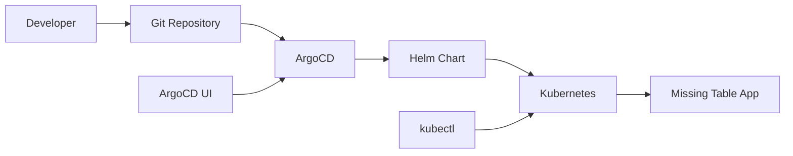

# Missing Table - ArgoCD GitOps

This directory contains ArgoCD configurations for deploying the Missing Table application using GitOps principles.

## 🎯 Learning Objectives

This ArgoCD setup will teach you:
- **GitOps Principles**: Infrastructure and application delivery through Git
- **ArgoCD**: Application deployment, sync policies, and management
- **Multi-Environment Management**: Dev, staging, and production workflows
- **Kubernetes Integration**: How ArgoCD manages Kubernetes resources

## 📁 Structure

```
argocd/
├── applications/
│   ├── missing-table-dev.yaml    # Development environment app
│   └── missing-table-prod.yaml   # Production environment app
├── install-argocd.sh            # Install ArgoCD in cluster
├── cleanup-argocd.sh            # Remove ArgoCD installation
└── README.md                    # This documentation
```

## 🚀 Quick Start

### 1. Install ArgoCD

```bash
# Install ArgoCD in your Rancher Desktop cluster
./argocd/install-argocd.sh
```

This script will:
- Create the `argocd` namespace
- Install ArgoCD components
- Expose ArgoCD server via LoadBalancer
- Display access credentials

### 2. Access ArgoCD UI

After installation, access the ArgoCD Web UI:
- **URL**: https://localhost:8080 (or the IP shown in install output)
- **Username**: `admin`
- **Password**: Generated during installation (shown in script output)

### 3. Deploy Applications

```bash
# Deploy development environment
kubectl apply -f argocd/applications/missing-table-dev.yaml

# Deploy production environment (optional)
kubectl apply -f argocd/applications/missing-table-prod.yaml
```

## 🏗️ Application Configurations

### Development Environment (`missing-table-dev.yaml`)

- **Source**: `v1.4` branch of your Git repository
- **Values**: Uses `values-dev.yaml` for reduced resources
- **Sync Policy**: Automated sync with self-healing
- **Target**: `missing-table` namespace

Key features:
```yaml
syncPolicy:
  automated:
    prune: true      # Remove resources not in Git
    selfHeal: true   # Fix configuration drift
    allowEmpty: false
  syncOptions:
    - CreateNamespace=true
```

### Production Environment (`missing-table-prod.yaml`)

- **Source**: `main` branch for stability
- **Values**: Uses production `values.yaml`
- **Sync Policy**: Manual sync for safety
- **Target**: `missing-table-prod` namespace

Key differences:
```yaml
syncPolicy:
  automated: {}  # Manual sync only
  retry:
    limit: 3     # Fewer retries
    backoff:
      duration: 10s  # Longer backoff
```

## 🔄 GitOps Workflow

### How It Works

1. **Code Changes**: Developer pushes changes to Git repository
2. **ArgoCD Detection**: ArgoCD polls Git repository for changes
3. **Sync Comparison**: Compares desired state (Git) vs actual state (Kubernetes)
4. **Automatic Deployment**: Syncs changes to Kubernetes cluster (if automated)
5. **Health Monitoring**: Continuously monitors application health

### Deployment Process



## 🎛️ ArgoCD Operations

### Using ArgoCD UI

1. **Applications Tab**: View all applications and their sync status
2. **Application Details**: See resources, sync status, and logs
3. **Sync Operations**: Manual sync, refresh, and hard refresh
4. **Rollback**: Rollback to previous versions
5. **Resource Tree**: Visual representation of Kubernetes resources

### Using ArgoCD CLI

```bash
# Install ArgoCD CLI
brew install argocd

# Login to ArgoCD
argocd login localhost:8080 --username admin --password <password> --insecure

# List applications
argocd app list

# Get application status
argocd app get missing-table-dev

# Sync application
argocd app sync missing-table-dev

# Rollback application
argocd app rollback missing-table-dev
```

### Using kubectl

```bash
# List ArgoCD applications
kubectl get applications -n argocd

# Get application details
kubectl get application missing-table-dev -n argocd -o yaml

# Watch application sync status
kubectl get applications -n argocd -w
```

## 📊 Monitoring and Observability

### Application Health

ArgoCD provides built-in health checking for:
- **Deployments**: Pod readiness and availability
- **Services**: Endpoint availability
- **Persistent Volumes**: Mount status
- **Custom Resources**: Resource-specific health checks

### Sync Status

- **Synced**: Desired state matches actual state
- **OutOfSync**: Configuration drift detected
- **Unknown**: Unable to determine sync status
- **Error**: Sync operation failed

### Application Metrics

ArgoCD tracks:
- Sync frequency and duration
- Application health over time
- Git repository polling frequency
- Resource count and status

## 🛠️ Configuration Management

### Repository Setup

Update the `repoURL` in application manifests:
```yaml
source:
  repoURL: https://github.com/YOUR_USERNAME/missing-table.git
  targetRevision: v1.4
  path: helm/missing-table
```

### Branch Strategy

- **Development**: Use feature branches or `v1.4` for active development
- **Staging**: Use `develop` or `staging` branch for testing
- **Production**: Use `main` branch for stable releases

### Values Management

Different environments use different Helm values:
```yaml
# Development
helm:
  valueFiles:
    - values-dev.yaml

# Production  
helm:
  valueFiles:
    - values.yaml
```

## 🔒 Security Considerations

### RBAC (Role-Based Access Control)

ArgoCD includes comprehensive RBAC:
- **Admin**: Full access to all applications
- **Developer**: Limited access to specific applications
- **Viewer**: Read-only access

### Git Repository Access

For private repositories:
1. Configure Git credentials in ArgoCD
2. Use SSH keys or personal access tokens
3. Set up webhook for faster sync triggers

### Image Security

- Use specific image tags in production (not `latest`)
- Implement image scanning in CI/CD pipeline
- Use private container registries when needed

## 🧪 Testing and Validation

### Dry Run Deployments

```bash
# Test Helm template rendering
helm template missing-table ./helm/missing-table --values ./helm/missing-table/values-dev.yaml

# Validate Kubernetes manifests
kubectl apply --dry-run=client -f <generated-manifests>
```

### Application Testing

```bash
# Test application health
kubectl get pods -n missing-table
curl http://localhost:8000/health
curl http://localhost:8080
```

### Rollback Testing

1. Deploy a working version
2. Deploy a broken version
3. Practice rollback procedures
4. Verify application recovery

## 🐛 Troubleshooting

### Common Issues

#### Application Stuck in "Progressing"
```bash
# Check application events
kubectl describe application missing-table-dev -n argocd

# Check resource events
kubectl get events -n missing-table --sort-by='.lastTimestamp'
```

#### Sync Failures
```bash
# Check ArgoCD logs
kubectl logs -f deployment/argocd-application-controller -n argocd

# Manual sync with replace
argocd app sync missing-table-dev --replace
```

#### Git Repository Access Issues
```bash
# Check repository connection
argocd repo list

# Test repository access
argocd repo get https://github.com/YOUR_USERNAME/missing-table.git
```

#### Health Check Failures
```bash
# Check resource health
kubectl get all -n missing-table

# Check specific resource
kubectl describe deployment missing-table-backend -n missing-table
```

## 🔄 Advanced Workflows

### Multi-Environment Promotion

1. **Development**: Automatic sync from feature branches
2. **Staging**: Manual promotion from development
3. **Production**: Manual promotion from staging with approvals

### Progressive Delivery

Integrate with tools like:
- **Argo Rollouts**: Blue-green and canary deployments
- **Flagger**: Progressive delivery with metrics analysis
- **Istio**: Traffic management and A/B testing

### Notifications

Configure ArgoCD notifications for:
- Sync failures
- Health check failures
- Successful deployments
- Security vulnerabilities

## 🧹 Cleanup

```bash
# Remove applications
kubectl delete -f argocd/applications/

# Remove ArgoCD
./argocd/cleanup-argocd.sh
```

## 📚 Learning Resources

### ArgoCD
- [ArgoCD Documentation](https://argo-cd.readthedocs.io/)
- [ArgoCD Best Practices](https://argo-cd.readthedocs.io/en/stable/user-guide/best_practices/)
- [GitOps Principles](https://www.gitops.tech/)

### GitOps
- [OpenGitOps](https://opengitops.dev/)
- [CNCF GitOps Working Group](https://github.com/cncf/tag-app-delivery/tree/main/gitops-wg)

### Kubernetes
- [Kubernetes Documentation](https://kubernetes.io/docs/)
- [Helm Documentation](https://helm.sh/docs/)

## 🚀 Next Steps

1. **Explore ArgoCD UI**: Familiarize yourself with the interface
2. **Practice GitOps**: Make changes in Git and watch ArgoCD sync
3. **Set up Notifications**: Configure Slack or email notifications
4. **Try Rollbacks**: Practice rolling back deployments
5. **Multi-Environment**: Set up staging and production environments
6. **Advanced Features**: Explore Argo Rollouts for progressive delivery