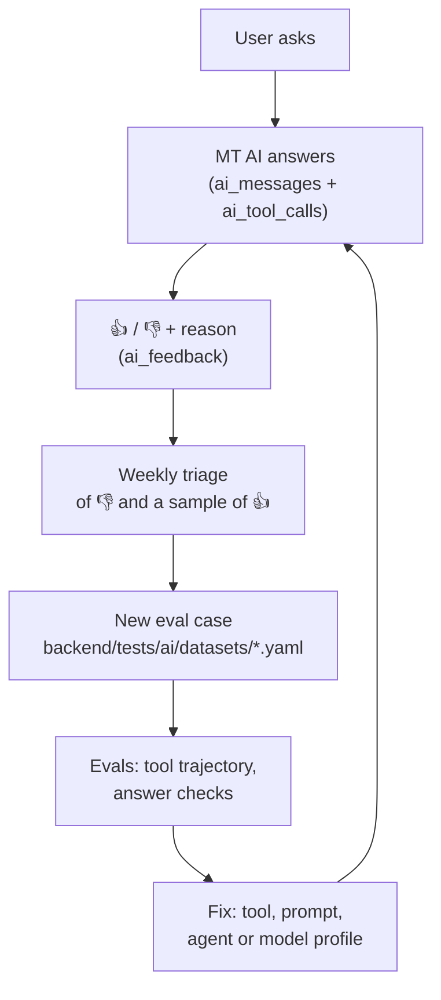

# MT 2.0 — MT AI Quality and Evaluation

> **Audience**: Anyone changing MT AI's prompts, tools, models or agent
> **Prerequisites**: [MT AI architecture](ai.md), [testing strategy](../../04-testing/testing-strategy.md)
> **Status**: Target design (2026-09-28, SB-1141). Nothing here is built yet.

How MT AI's answers are judged, how user feedback turns into regression tests, and how
the test suite is split so ordinary CI never waits on — or pays for — a model call.

---

## The loop



A 👎 is not fixed until it exists as an eval case that fails before the fix and passes
after it. That is the whole discipline.

---

## What is recorded

Everything needed to reproduce a turn without asking the user:

| Recorded | Where |
|----------|-------|
| user question, answer, entities, limitations | `ai_messages` |
| `agent_version`, `prompt_version`, model profile, provider, model | `ai_messages` |
| tool name, args, result (full, or digest + blob for large results), duration, error kind | `ai_tool_calls` |
| tokens, latency, cache flags, estimated cost | `ai_messages` ([ai-cost.md](ai-cost.md#metrics)) |
| rating, reason, comment | `ai_feedback` |
| eval result when a turn is promoted to a case | the dataset file (in git) |

Feedback reasons: `wrong_information`, `did_not_answer`, `missing_information`,
`confusing`, `outdated`, `other`.

Recorded tool results make **replay** possible: a case can be re-run against a new
prompt or model with the same data the user saw, even after prod data moved on.

**Retention and privacy**: conversations belong to logged-in users, some of them
parents of minors. Retention period and a delete path (the admin delete-user flow,
PR #645, already enumerates what goes with a user) must be settled in the migration that
creates these tables.

---

## Test tiers

| Tier | What | LLM? | Where it runs | Marker |
|------|------|------|---------------|--------|
| **0 — Tools** | Each tool: resolution, ambiguity, null vs `[]`, coverage, errors, viewer scope | No | every PR (`tests/unit`) | `unit` |
| **1 — Agent wiring** | Callbacks, budget guards, cache keys and epochs, persistence, API contract — with a **scripted fake model** that emits fixed tool calls | No | every PR | `unit` / `integration` |
| **2 — Live evals** | Real model on the datasets below; tool trajectory + answer checks | Yes | manual, nightly, and required before changing a model profile or prompt | `ai_eval` (new) |
| **3 — Judge** | LLM-as-judge for tone and clarity, where string checks cannot decide | Yes | on demand | `ai_eval` |

- `pytest -m "not ai_eval"` stays the default; CI never needs a provider key for
  tiers 0–1.
- Tier 2 has its own budget cap and can run against the `local` (Ollama) profile for
  free iteration, then against the real profile before merge.
- The judge model is from a **different model family** than the one being judged.

### Fixtures follow MT's data reality

Per the root `CLAUDE.md`, the **default fixture is a team with scraped matches and no
user data**. Every dataset covers all three states — unclaimed, claimed-empty,
populated — and includes the assertion that absent does not render as zero.

Eval fixtures are a frozen snapshot (seeded into local Supabase, or recorded tool
results for replay), never live prod. "Next match" cases pin a fake "today".

---

## Evaluation categories

| Category | What a case asserts |
|----------|---------------------|
| Factual correctness | the answer contains the fixture's truth (score, date, opponent, position) |
| Tool selection | expected tool trajectory (ADK trajectory eval; `ignore_args` where args are incidental) |
| Tool arguments | IDs, age group, season, date range are the right ones |
| Hallucination | no entity, score or date absent from tool results |
| Unavailable data | "not tracked" / "no data" instead of zero or invention |
| Ambiguous questions | a clarifying question with the real candidates, not a guess |
| Empty results | a correct "no upcoming matches" with the data-as-of date |
| Malformed data | a tool returning `unavailable` or odd rows yields a graceful answer |
| Latency | p95 turn time under a threshold on the eval profile |
| Token usage | tokens per case within a budget; regression flags growth |
| Provider/model change | whole suite re-run; per-category pass rate compared with the previous profile |

---

## Dataset layout

Tests live under `backend/tests/` in this repository, so AI evals do too:

```text
backend/tests/ai/
  datasets/
    basic_questions.yaml
    teams.yaml
    matches.yaml
    standings.yaml
    ambiguous_questions.yaml
    unavailable_data.yaml       # absent ≠ zero; the most MT-specific file
    analysis.yaml               # MatchAnalysis specialist, when it exists
  fixtures/                     # frozen snapshots / recorded tool results
  test_tools_*.py               # tier 0
  test_agent_*.py               # tier 1 (fake model)
  test_evals.py                 # tier 2 runner, @pytest.mark.ai_eval
```

A case:

```yaml
- id: next-match-unclaimed-001
  question: "Who does Boston United U15 play next?"
  viewer: { role: team-fan, is_test: false }
  context: { team_id: null }
  today: "2026-09-28"
  fixture: unclaimed_team_with_schedule
  expect:
    tools: [search_teams, get_upcoming_matches]    # trajectory, in order
    args:
      get_upcoming_matches: { team_id: 123, age_group: "U15" }
    answer_contains: ["IFA", "4 Oct"]
    answer_excludes: ["0 goals"]
    limitations_contains: []
  tags: [matches, unclaimed]
  origin: feedback#<ai_feedback id>      # or "seed"
```

The same cases feed ADK's evaluation (trajectory) and a small pytest runner for the
MT-specific checks ADK does not know about (`answer_excludes`, limitations, viewer
scope).

---

## Gates

- **Prompt or agent change**: tier 0–1 green in CI, tier 2 pass rate not lower than
  `main` on any category.
- **Model profile change**: full tier 2 on the new profile; token and latency within
  budget; recorded in the PR.
- **New tool**: tier 0 tests for all three data states before the agent can call it.

---

## 📖 Related Documentation

- **[MT AI architecture](ai.md)** · **[AI cost](ai-cost.md)**
- **[Testing strategy](../../04-testing/testing-strategy.md)** · **[Backend testing](../../04-testing/backend-testing.md)**
