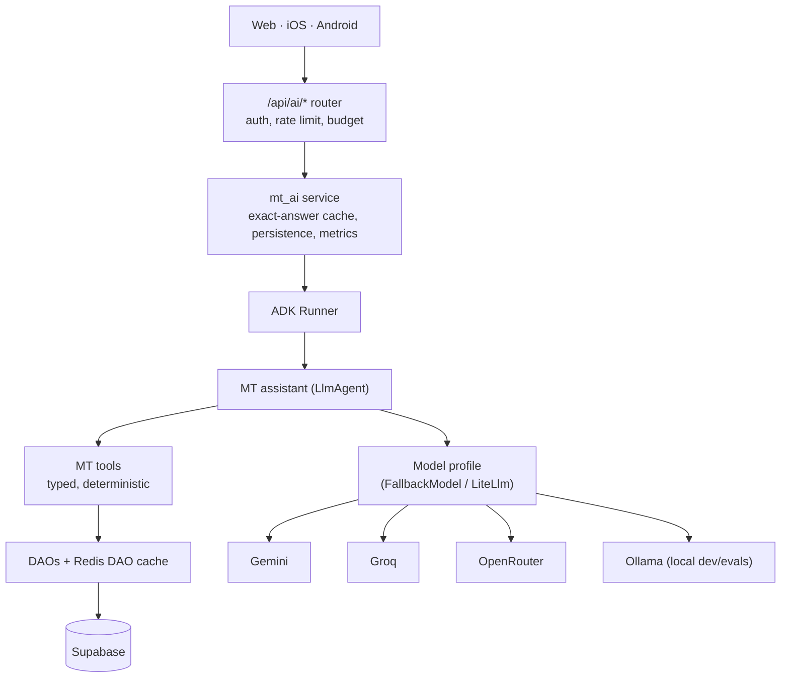

# MT 2.0 — MT AI Architecture

> **Audience**: Anyone building MT AI (the chat assistant) or its tools
> **Prerequisites**: [Current state](current-state.md), [caching.md](../caching.md)
> **Status**: Target design (2026-09-28, SB-1141). Nothing here is built yet.

MT AI answers questions about teams, matches and standings in plain language. This
document fixes where it runs, the API clients see, how it reaches MT data, how Google
ADK and PydanticAI divide the work, and how it stays independent of any one model.
Cost is in [ai-cost.md](ai-cost.md); quality and evaluation in [ai-quality.md](ai-quality.md).

---

## Principles

1. **Clients never know the model or framework.** Web, iOS and Android speak to
   `/api/ai/*`. Swapping Gemini for a Groq-hosted model, or ADK for something else, is
   a backend deploy with no client release.
2. **The model never touches the database.** It calls deterministic, typed MT tools.
   Tools are ordinary Python functions with ordinary tests.
3. **Deterministic first.** Two MT AI experiments were retired because an LLM was
   doing work that code does better: `match-scraper-agent` moved scrape planning from
   PydanticAI + Claude Haiku to a rules engine (March 2026), and the CrewAI test crew
   was retired (July 2026). The model's job is language — understanding the question
   and phrasing the answer. Resolving a team, picking a season and computing standings
   are code.
4. **Absent is not zero.** MT's data rules apply to answers too (root `CLAUDE.md`,
   "Most Teams Have No User Data"): a team with no logged goals has *untracked* scorers,
   not zero goals, and a cross-team statistic states its coverage.
5. **Small and replaceable.** No router service, no vector store, no second datastore
   until measurements ask for one.

---

## Where MT AI runs

### Options

| | 1. In the backend process | 2. Separate Deployment, same cluster | 3. External (serverless / managed agent platform) |
|---|---|---|---|
| Simplicity | One image, one deploy, reuses auth, DAOs, Redis | Second Deployment and Service; shared or new image | New platform, new auth hop, new deploy path |
| Cost | Zero extra baseline | Another pod's memory on a 4 GB node shared by three apps | Platform fees; egress to MT API |
| Scaling | Scales with API replicas (1 today) | Independent | Independent |
| Failure isolation | Weakest: a slow or leaking AI path shares the event loop and memory with every request | Good: AI can crash without the API | Good |
| Observability | Existing structlog + `/metrics` for free | Same stack, new scrape target | New stack or bridging |
| Dev experience | `./missing-table.sh dev` already runs it | Two processes locally | Emulators / cloud-only |
| Data access | Direct DAO calls with the DAO cache | HTTP back to the API, or its own DB client | HTTP back to the API |

### Recommendation: 1 now, built so that 2 is a configuration change

Start **inside the backend process**, as its own package with a hard boundary:

```text
backend/
  mt_ai/
    api.py          # APIRouter: /api/ai/* — the only thing app.py imports
    service.py      # chat orchestration: budget, cache, runner call, persistence
    agent.py        # ADK agent definitions (instructions, tools, callbacks)
    models.py       # model profiles → ADK model objects (see "Model providers")
    tools/          # deterministic tools; import DAOs, never mt_ai.agent
    schemas.py      # Pydantic request/response + tool result models
```

Why in-process first: the cluster is one 2 vCPU / 4 GB node with one backend replica,
LLM calls are network-bound async I/O rather than CPU work, and the tools want the DAO
layer and its Redis cache — a separate service would have to call back over HTTP.

What keeps the move to option 2 cheap:

- `mt_ai` is mounted as a router behind a setting (`MT_AI_ENABLED`). A second
  Deployment of the **same image** that serves only `/api/ai/*`, with ingress routing
  that path to it, is option 2 without a code change.
- Every model call has a timeout and a process-wide concurrency cap, so a stuck
  provider cannot exhaust the API's connections.
- Tools depend on DAOs/services, never on FastAPI request objects.

**Move to option 2 when any of these is measured**: p95 of non-AI endpoints degrades
while AI traffic is present; backend memory rises by more than ~150 MB with `mt_ai`
loaded; AI needs a different replica count than the API. Option 3 is not recommended —
it adds a platform and an auth hop to save nothing at this scale.



---

## API boundary

Follows MT's conventions: `/api` prefix, bearer auth, JSON. This section is the
target contract. What is built today is the smaller walking skeleton in
[Walking skeleton (SB-1143)](#walking-skeleton-sb-1143) below.

### `POST /api/ai/chat`

```jsonc
// request
{
  "conversation_id": "uuid | null",      // null starts a new conversation
  "message": "Who does Boston United U15 play next?",
  "context": { "team_id": 123 }          // optional: the page the user asked from
}
// response 200
{
  "conversation_id": "uuid",
  "message_id": "uuid",                  // what feedback refers to
  "answer": "Boston United U15 play IFA on Sat 4 Oct, 10:00 at …",
  "entities": [{ "type": "match", "id": 1190 }, { "type": "team", "id": 123 }],
  "data_as_of": "2026-09-28T14:02:00Z",  // freshest source the answer used
  "limitations": ["Goal scorers are not tracked for this team."]
}
```

Responses name MT entities so clients can deep-link; they never carry model,
provider, token or cost fields. Streaming (SSE) is a later, additive change.

### `POST /api/ai/feedback`

```jsonc
{ "message_id": "uuid", "rating": "up" | "down",
  "reason": "wrong_information" | "did_not_answer" | "missing_information"
          | "confusing" | "outdated" | "other" | null,
  "comment": "string | null" }
```

### `GET /api/ai/conversations/{conversation_id}`

Returns the caller's own conversation (messages, entities, their feedback). Another
user's conversation is a `404`.

### Errors

| Condition | Status | Body |
|-----------|--------|------|
| Not logged in | 401 | standard |
| Per-user rate or daily budget exceeded | 429 | `{ "reason": "budget" }` |
| All models unavailable / global budget exhausted | 503 | `{ "reason": "unavailable" }` — clients show a calm fallback |
| The question cannot be answered from MT data | **200** | an answer that says so — a correct refusal is a success |

### Auth

- **Login required**, like almost every MT read endpoint today. The invite-only
  posture holds.
- Tools run **as the caller**: the user's `is_test` visibility
  (`viewer_sees_test_content`) is passed to every tool, so the prod test partition never
  leaks into an answer.
- Admin-only data (ingest failures, audit, user lists) is **not** reachable from any
  MT AI tool in v1, whatever the caller's role.

### Storage

New tables (a later migration; each must pick a backup policy per the root `CLAUDE.md`):
`ai_conversations`, `ai_messages` (question, answer, agent/prompt version, model,
tokens, latency, cache flags, estimated cost), `ai_tool_calls` (name, args, result
digest, duration, error kind), `ai_feedback`. These are MT's system of record for
conversations; ADK's session is rebuilt from them per request (see below).

---

## Tools

### What the existing system actually supports

| Proposed tool | Backing today | Status |
|---------------|---------------|--------|
| `search_teams` | `mt_ai/tools/teams.py`: exact name over cached `get_all_teams`, then `TeamDAO.resolve_team_by_name` (aliases), then in-memory near-matches using `TeamDAO._SIMILAR_STOPWORDS` | **Built (SB-1142)** |
| `get_team` | No `GET /api/teams/{id}`; team rows + `team_mappings` (age groups/divisions) via `TeamDAO` | **Build** thin DAO-backed tool |
| `search_clubs` | `/api/clubs` lists all; exact-name lookups only | **Build** (in-memory filter over the cached list is enough at MT's size) |
| `get_club` | `GET /api/clubs/{id}`, `/api/clubs/{id}/teams` | Supported |
| `get_match` | `GET /api/matches/{id}`, live state, events | Supported |
| `get_upcoming_matches` | `mt_ai/tools/matches.py` over `MatchDAO.get_all_matches(start_date=…, raise_on_error=True)` | **Built (SB-1142)** |
| `get_recent_matches` | same | **Build**, same basis |
| `get_standings` | `GET /api/table` → `MatchDAO.get_standings` (cached) → pure `dao/standings.py` | Supported; League/Flex need `division_id` |
| `get_league` | `GET /api/leagues/{id}` | Supported |
| `get_team_stats` | `GET /api/teams/{id}/stats` (Golden Boot) | Supported — **user data; must carry coverage** |
| `get_tournament` | `/api/tournaments/{id}` | Supported |
| `get_qop_rankings` | `/api/qop-rankings` | Supported |
| `search_players` | admin-only `?search=`; profiles are of **minors** | **Not in v1** (see below) |
| `search_mt` | nothing | **Not built** — the agent composes specific tools; a catch-all tool hides which data was used |

**Players are out of v1.** Player records are user-generated, cover a minority of
teams, and describe children. A free-text player search reachable by any logged-in
user is a privacy decision, not a tooling one; it needs its own ticket and review.

### Multi-age teams make resolution the hard part

One MT team spans several age groups (`team_mappings`), so "Boston United" alone does
not identify a schedule. Resolution is therefore a tool step with an explicit
ambiguity result, not something left to the model:

```python
class TeamCandidate(BaseModel):
    team_id: int
    name: str
    club: str | None
    age_group: str | None
    registrations: list[Registration]   # every competition at that age (SB-1146)

class ResolveResult(BaseModel):
    status: Literal["resolved", "ambiguous", "not_found"]
    team: TeamCandidate | None
    age_group: str | None          # when the question or context fixed one
    candidates: list[TeamCandidate] = []   # when ambiguous
```

The agent is instructed to ask a clarifying question on `ambiguous` rather than guess;
`context.team_id` from the page the user is on usually removes the ambiguity.

### What building the first two tools taught (SB-1142)

- **Test visibility for teams is derived, not stored.** Teams have no `is_test`
  column; a team is test content when its club or its own league is. The tools
  build that from cached club and league reads (`mt_ai/tools/visibility.py`), and
  a registration in a test league's division is hidden too.
- **Two DAO reads swallow errors as `[]`.** `get_all_matches` now takes a
  keyword-only `raise_on_error` (default unchanged for endpoints) so a failed
  read is `unavailable`, not "no matches". `get_all_leagues` still returns `[]`
  on failure; the tools treat an empty league list as unavailable and fail
  closed, because without it test teams cannot be hidden.
- **`get_team_by_name` passes its input to `ilike` unescaped**, so `%` and `_`
  act as wildcards. Harmless for scraper names, not for user-typed text: the
  tool never sends a name containing them to the database.
- **Two competitions at one age are one team, not two** (SB-1146, found by the
  first live prod request). IFA U15 plays Homegrown *and* Flex. The tool first
  built candidates from `divisions_by_age_group`, a dict keyed by age group,
  so the second competition was lost and IFA U15 came back as two identical
  "ambiguous" candidates. Candidates now come from the raw `team_mappings`
  rows: one per (team, age group), carrying `registrations: [{league, division}]`.
- **"Today" is the club's day** (`clubs.timezone`, default `America/New_York`),
  computed in the tool with an injectable clock for tests.

### Tool contract

- **Inputs** are Pydantic models with IDs, not names, except the `search_*`/resolve
  tools. Dates are ISO, resolved in the club's timezone by the tool, never by the model.
- **Outputs** are Pydantic models, trimmed to what an answer needs (no raw DAO dicts,
  no email/phone/user IDs). Each carries provenance:

  ```python
  class ToolMeta(BaseModel):
      source: Literal["scraper", "user", "mixed"]
      as_of: datetime | None        # newest updated_at among rows used
      coverage: str | None          # e.g. "goals recorded for 9 of 74 teams"
      truncated: bool = False
  ```

- **Null vs empty is preserved.** `scorers: None` means not tracked; `scorers: []`
  means tracked, nobody scored. The instructions and the evals both hold the model to
  that distinction.
- **Errors are results, not exceptions.** Tools return a typed error
  (`not_found`, `ambiguous`, `invalid_args`, `unavailable`) the model can explain.
  Unexpected exceptions are caught at the tool boundary, logged with the request ID,
  and surfaced as `unavailable`.
- **Budgets**: at most N tool calls per turn (start at 6) and a row cap per result.

### Data access and freshness

- Tools call **DAOs directly** (in-process), which gives them the Redis DAO cache and
  its write-driven invalidation for free. Where a route contains authorization or
  shaping logic a tool also needs, that logic moves into a shared function the route
  and the tool both call — one extraction per tool, done in the tool's own slice, not a
  big-bang refactor of `app.py`.
- Scraped results arrive via the scraper-agent CronJobs (every six hours, with four
  extra runs on weekend days) through a Celery worker that currently runs on a laptop.
  Answers therefore report `data_as_of`, and "latest score" questions about an
  in-progress match prefer live state (`/api/matches/{id}/live`) when it exists.

### Testability

Every tool is a plain function of (DAO, args, viewer) → Pydantic result:

- **Unit tests** with fake DAOs, built from the default fixture — a team with scraped
  matches and **no** user data — plus the claimed-empty and populated states.
- **Integration tests** against local Supabase for the DAO queries the tools add.
- **No LLM in either.** Model-dependent behaviour is covered by evals
  ([ai-quality.md](ai-quality.md)).

---

## Walking skeleton (SB-1143)

The first end-to-end path. It proves the plumbing, not the assistant.

```text
POST /api/ai/chat          mt_ai/api.py       validate, authenticate, map errors to status codes
  → ChatService.chat       mt_ai/service.py   load/create conversation, rebuild history, persist the turn
    → run_turn             mt_ai/agent.py     the only module that imports ADK
      → ADK Runner + LlmAgent(tools=[search_teams]), RunConfig(max_llm_calls)
        → search_teams     mt_ai/tools/       unchanged from SB-1142; no ADK, no HTTP
```

### `/api/ai/chat` as built

- Request: `{ "message": str (1–2000, not blank), "conversation_id": uuid | null }`.
  Login required (`get_ai_user`): a person's session, or an API account's token
  (below). A service account is refused with a 403.
- `200`: `{ conversation_id, turn, status: "ok" | "budget_exhausted", answer, message }`.
  `answer` is null and `message` explains when the budget stopped the turn.
- Errors use MT's usual `{"detail": str}`:

  | Status | When |
  |--------|------|
  | 401 | no token, or an invalid/expired one |
  | 403 | a service account: it has no `user_profiles` row to own a conversation (SB-1145; was a KeyError 500) |
  | 422 | invalid body |
  | 404 | conversation missing **or owned by someone else** (indistinguishable on purpose) |
  | 502 | the model or the agent run failed; no internals in the body |
  | 503 | MT AI not enabled, or the conversation could not be loaded/saved |

- The target contract's `context`, `entities`, `data_as_of` and `limitations` are
  not built yet.

### API-only accounts (SB-1145)

Evals and automation run as their own principals, never on a human's session:
an admin sees the test partition, so an eval run as Tom proves nothing about what
a fan sees.

- An API account is a `user_profiles` row with `is_api_account = true`, a
  non-admin role (`team-fan`) and **no `auth.users` row** — no password, so it
  cannot log in to the web app. A session token that names one is refused anyway.
- Its only credential is an HS256 token signed with `SERVICE_ACCOUNT_SECRET`,
  audience `mt-ai-api`, 7 days by default and 30 at most. Every other endpoint
  decodes with `authenticated` or `service-account`, so it is **rejected
  everywhere but `/api/ai/*`**. The profile is re-read per request: clearing
  `is_api_account` or deleting the row revokes outstanding tokens at once.
- Two exist for the eval: `ai_eval_real` (`is_test = false`) and `ai_eval_test`
  (`is_test = true`), so a prod run can prove the test partition is hidden.
- **Attribution:** eval traffic is every conversation whose owner has
  `is_api_account`. Real-usage numbers exclude it:

  ```sql
  SELECT count(*) FROM ai_conversations c
  JOIN user_profiles u ON u.id = c.user_id
  WHERE NOT u.is_api_account;
  ```

`backend/scripts/manage_ai_users.py` manages them. `ensure` is idempotent;
`token` writes a 0600 file, or with `--out -` writes stdout **only when it is
redirected** — it refuses a terminal, so a token never lands in a transcript.

```bash
APP_ENV=local uv run python scripts/manage_ai_users.py ensure
APP_ENV=local uv run python scripts/manage_ai_users.py token ai_eval_real --out ~/.config/mt/ai_eval_real.local.jwt

# Prod: mint inside the backend pod, so the token is signed with the secret prod verifies with
kubectl exec deploy/missing-table-backend -n missing-table -- \
  /app/.venv/bin/python scripts/manage_ai_users.py ensure
kubectl exec deploy/missing-table-backend -n missing-table -- \
  /app/.venv/bin/python scripts/manage_ai_users.py token ai_eval_real --out - \
  > ~/.config/mt/ai_eval_real.prod.jwt
```

`token` refuses to run without `SERVICE_ACCOUNT_SECRET`: `AuthManager` would fall
back to a random secret and mint a token no server accepts. `.env.local` does not
set one, so local minting needs it exported for both the script and the backend.

### Conversation lifecycle and persistence

- Migration `20260929000000_ai_conversations.sql` adds `ai_conversations` (owner,
  agent version) and `ai_messages` (one **user** and one **assistant** row per
  `turn`, with `status`, `model`, `agent_version`, `llm_calls`, `tool_calls`).
  Both tables cascade from `user_profiles`. RLS lets a user read their own rows and
  admins read everything; the backend writes with the service key.
- A new conversation row is created **before** the model runs, so a storage failure
  costs no model call. Both rows of a turn are written together **after** it, and
  that includes failed turns: `budget_exhausted` and `ai_failed` are recorded with
  no content.
- **History is rebuilt from `ai_messages` on every request** into an in-memory ADK
  session. Only turns with an `ok` answer are replayed. MT's tables are the record;
  ADK's session format can change without a migration.
- Backups: both tables are backed up and listed in `RESTORE_SKIPPED`, so users'
  conversations never land in a local environment. The admin delete-user preflight
  lists them.
- `AIConversationDAO` **raises** instead of returning `[]`/`None`. A swallowed
  error here would silently start a fresh conversation.
- The DAO writes an explicit, identical column set for both rows. PostgREST
  bulk-inserts the union of the rows' keys and sends NULL, not the column DEFAULT,
  for any key a row omits.

### Budget guard

`mt_ai/budget.py`, deterministic, per request (defaults 4 model calls / 3 tool calls):

- **Model calls**: ADK's own `RunConfig.max_llm_calls` refuses the call that would
  exceed it (`LlmCallsLimitExceededError`).
- **Tool calls**: `ToolCallGuard`, a `before_tool_callback`, raises before the
  tool that would exceed it runs.
- Either way the run stops and the turn is returned as `budget_exhausted`. Tokens,
  cost and per-user quotas are not implemented (see [ai-cost.md](ai-cost.md)).
- ADK logs its own ERROR-level "node failed" lines when the guard stops a run.
  That is expected and is not an incident.

### Tool boundary

`make_search_teams_tool(deps, viewer)` closes over this request's DAOs and the
caller's `Viewer`. The model supplies only `query` and `age_group`, so it cannot
widen test-partition visibility. The typed result reaches the model as
`model_dump(mode="json")`.

### Configuration

Off unless `MT_AI_ENABLED=true` **and** `MT_AI_MODEL` is set; otherwise `503`.
No model id is hardcoded. A Gemini id also needs `GOOGLE_API_KEY` in the
backend's environment. None of these are set in prod yet, so the route is
deployed but inert.

### Dependency

`google-adk==2.10.0`, pinned exactly. Every ADK release from 2.5 on requires
`starlette>=1.3.1`, so the lockfile moves starlette 0.51 → 1.7,
prometheus-fastapi-instrumentator 7 → 8, OpenTelemetry 1.36 → 1.42 and
pydantic 2.12 → 2.13. `/metrics` and router-included endpoints were re-checked
against the `fastapi<0.137` crash that pin guards against.

### Tests

`backend/tests/unit/mt_ai/`. `ScriptedLlm` is a real ADK `BaseLlm` with a
scripted reply, so the runner, tool dispatch and callbacks are the production
path and no test calls a provider. Covered:

- tool declaration and the typed result reaching the model;
- server-bound viewer;
- both budget limits, including that the extra tool never executes;
- history replay;
- the lifecycle: create, continue, not found, someone else's conversation;
- failures: AI failure, persistence failures at load and at save;
- the API status codes;
- the DAO's column set.

### Not implemented yet (deliberately)

- **Chat features:** streaming, feedback, `GET /api/ai/conversations/{id}`,
  `context`/`entities`/`data_as_of`, and other tools.
- **Cost and control:** answer caching, token/cost accounting, per-user quotas,
  model profiles/`FallbackModel`, and a `ai_tool_calls` table.
- **Agent design:** memory beyond replaying turns, multiple agents, A2A.

## Google ADK as the primary framework

ADK is the agent runtime. Current release at the time of writing is v2.9.0
(2026-09-10), which added `FallbackModel` for automatic model failover and a
`ignore_args` option to tool-trajectory evaluation
([release notes](https://github.com/google/adk-python/releases)). Pin the version; its
session semantics changed in that release.

How MT AI uses each ADK concept — each one earns its place:

| ADK concept | MT AI use |
|-------------|-----------|
| **Runner** | One per process; `service.py` calls it per chat turn |
| **Agent** (`LlmAgent`) | One root agent, `mt_assistant`, with the tools above |
| **Tools** | The MT tools, wrapped as function tools; typed signatures produce the schemas |
| **Sessions** | `InMemorySessionService`, **rebuilt per request from `ai_messages`**. MT's backend has no SQLAlchemy/direct-Postgres runtime path today, so `DatabaseSessionService` would add one; revisit if conversation rehydration becomes a cost |
| **State** | Per-conversation resolved context (current team, age group, season) so follow-ups ("and after that?") need no re-resolution |
| **Callbacks** | `before_model`: budget check, token estimate. `after_model`: token/latency accounting. `before_tool`: arg validation, viewer scope injection. `after_tool`: record `ai_tool_calls` |
| **Structured output** | Final answer envelope (`answer`, `entities`, `limitations`) as an output schema, so the API does not parse prose |
| **Model configuration** | Model profiles (below) |
| **Evaluation** | ADK eval sets for tool trajectory; see [ai-quality.md](ai-quality.md) |
| **Agent composition** | Deferred. A specialist becomes a sub-agent or `AgentTool` only when a measured failure calls for it |

---

## PydanticAI — where it earns a place

PydanticAI is **not** a second agent runtime. It fits one shape: a **typed specialist
function** whose output is a validated Pydantic model, invoked from ADK as a tool.

```python
class MatchAnalysis(BaseModel):
    summary: str
    form: str
    notable_results: list[str]
    trends: list[str]
    data_limitations: list[str]     # required: what the data could not say

async def analyze_team_form(team_id: int, age_group_id: int, viewer: Viewer) -> MatchAnalysis:
    matches = await recent_matches(...)          # deterministic tool, no LLM
    table   = await standings(...)               # deterministic tool, no LLM
    return await form_analyst.run(               # PydanticAI Agent[..., MatchAnalysis]
        render(matches, table)
    )
```

The ADK agent sees `analyze_team_form` as one more tool. Inside it, PydanticAI gives
typed dependencies, output validation with retry, and `pydantic_evals` for the
specialist in isolation.

**Gate before adopting it**: ADK's own output schema may be enough for `MatchAnalysis`.
The first analysis slice builds it with ADK alone and adopts PydanticAI only if
validation/retry or testability is measurably better. Two frameworks cost two
dependency trees and two provider configurations, so both must read the same model
profiles (below). PydanticAI has built-in Gemini, Groq and OpenRouter support and
reaches Ollama through its OpenAI-compatible model
([models overview](https://pydantic.dev/docs/ai/models/overview/)).

---

## Model providers

### What ADK already provides

- Gemini through `google-genai`, named by model string.
- Other providers through `google.adk.models.lite_llm.LiteLlm` with LiteLLM's
  `provider/model` strings (Groq, OpenRouter, Ollama, Anthropic, OpenAI, …)
  ([ADK: LiteLLM](https://adk.dev/agents/models/litellm/), [ADK: Ollama](https://adk.dev/agents/models/ollama/)).
- `FallbackModel` (v2.9.0) for primary → backup failover.

So MT does **not** need its own router class. The abstraction is a small registry of
**model profiles**, resolved from settings:

```python
# mt_ai/models.py  (sketch)
PROFILES = {
    "chat":     ["gemini/<flash-tier>", "groq/<open-model>"],   # primary, fallback
    "analysis": ["gemini/<pro-tier>",   "openrouter/<model>"],
    "judge":    ["<different family from chat>"],               # evals only
    "local":    ["ollama_chat/<model>"],                        # dev + offline evals
}

def build_model(profile: str) -> BaseLlm: ...   # FallbackModel over the list
```

- Profiles are configuration (`MT_AI_PROFILE_CHAT=…`), not code. Agent code names a
  profile, never a provider.
- Model identifiers and prices are deliberately left out of this document: they change
  monthly. The eval suite chooses them.
- **A model enters a profile only after passing the eval suite** — tool-calling and
  structured-output support vary widely across Groq, OpenRouter and Ollama models.
- **Pin LiteLLM exactly and review upgrades.** LiteLLM versions 1.82.7 and 1.82.8
  shipped unauthorized code ([ADK: LiteLLM](https://adk.dev/agents/models/litellm/));
  it sits on the path of every non-Gemini call and holds provider keys.
- Provider keys go into AWS Secrets Manager → ESO → `missing-table-secrets`, like
  every other backend secret.

---

## Observability

- structlog events per turn and per tool call, carrying the existing `mt-req-*` /
  `mt-sess-*` IDs plus `conversation_id` and `message_id`.
- Prometheus counters/histograms added to the existing `/metrics` (names in
  [ai-cost.md](ai-cost.md#metrics)). Grafana Cloud already scrapes the pod.
- No new tracing stack; wiring the already-declared OpenTelemetry packages is a
  separate decision.

---

## 📖 Related Documentation

- **[AI cost](ai-cost.md)** — caching and budgets
- **[AI quality](ai-quality.md)** — feedback and evaluations
- **[A2A](a2a.md)** — why not yet
- **[Current state](current-state.md)** · **[MT 2.0 overview](README.md)**
- **[CrewAI retrospective](../../04-testing/crewai-experiment-retrospective.md)** — the previous agent experiment
