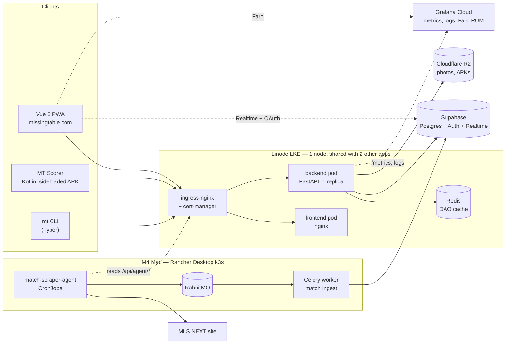
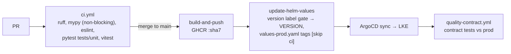

# MT 2.0 — Current-State Architecture

> **Audience**: Anyone starting MT 2.0 work
> **Prerequisites**: None
> **Verified**: 2026-09-28 against `main` @ `162f796` (v1.62.5, build 1597), SB-1141

A factual snapshot of what MissingTable is today, taken from the repositories rather
than from memory. It does not redesign anything — target designs live in the sibling
documents. Where older docs disagree with the code, the code wins and the drift is
listed under [technical debt](#technical-debt-relevant-to-mt-20).

---

## System overview

MT is five repositories, one Kubernetes cluster, one Supabase project, and a laptop.

| Repository | Role |
|------------|------|
| `silverbeer/missing-table` (this repo) | FastAPI backend, Vue web app, Helm chart, Supabase migrations, CI |
| `silverbeer/missing-table-android` | Native Kotlin "MT Scorer" app (see [mobile.md](mobile.md)) |
| `silverbeer/match-scraper` | Playwright scraper of MLS NEXT results + QoP rankings; also a library |
| `silverbeer/match-scraper-agent` | Scheduler/orchestrator for the scraper — a deterministic rules engine |
| `silverbeer/missingtable-platform-bootstrap` | Terraform: LKE cluster, ArgoCD, ESO, cert-manager, Grafana Cloud, DNS, R2 |

---

## Backend

**FastAPI, Python ≥ 3.13, managed with `uv`** (`backend/pyproject.toml`).

- **Monolith entry point.** `backend/app.py` is 8,736 lines and defines **171 routes
  directly** with `@app.<verb>`. Nine `APIRouter`s in `backend/api/` and
  `backend/endpoints/` cover invites, invite/channel requests, club notifications,
  push, email webhooks, admin email/attention, and `/api/version`.
- **No `response_model` anywhere in `app.py`.** About 68 Pydantic classes exist in
  `backend/models/` (plus ~11 inline), used for request bodies; responses are plain
  dicts. `openapi.json` therefore describes inputs, not outputs.
- **Middleware:** CORS → `TraceMiddleware` (binds `X-Session-ID`/`X-Request-ID` to logs).
  slowapi rate limits login, signup and password reset only. CSRF middleware is
  commented out (`app.py:166`).
- **Background work:** FastAPI `BackgroundTasks` for notifications; Celery for match
  ingest (below).
- **`mt` CLI** (`backend/mt_cli.py`, 2,108 lines): Typer/Rich HTTP client over
  `api_client.MissingTableClient`. It was written to be driven by an external chat
  agent ("Claw", `backend/MT_CLI_README.md`) during live matches — MT's only existing
  conversational interface, and it works by calling deterministic commands.

### Read API surface (what MT AI tools could stand on)

| Domain | Endpoints |
|--------|-----------|
| Teams | `GET /api/teams` (ID filters only), `/api/teams/{id}/players`, `/roster`, `/stats`, `/match-types` |
| Clubs | `GET /api/clubs`, `/api/clubs/{id}`, `/api/clubs/{id}/teams` |
| Matches | `GET /api/matches` (season, age group, division, team, type, date range), `/api/matches/{id}`, `/api/matches/team/{team_id}`, `/api/matches/live`, `/api/matches/preview/{home}/{away}`, live events, lineups |
| Standings | `GET /api/table`, `/api/qop-rankings`, `/api/playoffs/bracket`, `/api/leaderboards/goals` |
| Reference | leagues, divisions, age-groups, seasons, current-season, match-types |
| Players | `/api/players/{user_id}/profile`, `/api/roster/{id}/stats`, `/api/me/player-stats` |
| Tournaments | `/api/tournaments`, `/api/tournaments/{id}` |
| Agent | `/api/agent/match-summary`, `/api/agent/matches`, `/api/agent/audit/*` — used by the scraper agent |

**There is no public text search** over teams, clubs or players. The only server-side
free-text search is admin-only (`GET /api/admin/players?search=`); otherwise lookups
are by exact name (`GET /api/admin/teams/lookup`) or by ID.

### Data access

- **DAO pattern**, 29 files in `backend/dao/`. `BaseDAO` (`dao/base_dao.py`) supplies
  query helpers and the cache decorators. `dao/standings.py` is pure functions
  (`calculate_standings`, `calculate_standings_with_extras`).
- **All runtime DB access goes through supabase-py (PostgREST)** with the service key,
  which bypasses RLS; authorization is enforced in the API layer. A handful of `.rpc()`
  calls exist. `psycopg2` appears only in scripts.
- **DAOs return dicts**; there is no shared domain-model package.

### Caching (today)

Detailed in [caching.md](../caching.md). In brief:

- **Redis DAO cache**: `@dao_cache("…")` keys under `mt:dao:*`, TTL 24 h default;
  `@invalidates_cache(pattern)` SCAN+DELs on write. Gated by `CACHE_ENABLED`; skipped
  if Redis is unreachable. An ArgoCD PostSync hook flushes `mt:dao:*` on every deploy.
  Direct SQL in Supabase Studio bypasses invalidation.
- **Service-worker cache** in the browser for read APIs, busted wholesale after any write.
- **Realtime**: Supabase subscriptions for live matches (`useLiveRowSync.js`).

### Match ingest

`match-scraper-agent` CronJobs decide what to scrape, run `match-scraper`, and publish
to RabbitMQ (`matches-fanout` / `matches.prod`). The Celery task
`celery_tasks.match_tasks.process_match_data` resolves names, upserts matches and
scores, and records unresolvable names in `ingest_failures`. QoP rankings are POSTed
over HTTP to `/api/qop-rankings`.

**RabbitMQ, the prod Celery worker and the scraper CronJobs all run on a local M4 Mac
(Rancher Desktop k3s)**, writing to cloud Supabase (`k3s/worker/deployment-prod.yaml`:
"not in LKE — no Celery worker or RabbitMQ runs there").

---

## Web

**Vue 3, plain JavaScript (no TypeScript), Vite 5, Tailwind 3** (`frontend/`).

- **No vue-router**: `App.vue` switches views with a `currentTab` ref; views are
  lazy-loaded via `utils/lazyView.js`.
- **No Pinia/Vuex**: `stores/auth.js` (~1,100 lines) is a module-level `reactive()`
  singleton, plus ~19 composables.
- **API client**: `auth.apiRequest()` adds the bearer token and CSRF header and retries
  once after a refresh. Base URL is decided at runtime (`config/api.js`). Tokens live in
  `localStorage`. The Supabase JS client is used only for OAuth and Realtime.
- **PWA**: `vite-plugin-pwa` (`injectManifest`) with a custom `src/sw.js` — precache,
  read-API caching, offline fallback, Web Push.
- **106 `.vue` components**; RUM via Grafana Faro.

---

## Data

- **Supabase** (cloud-hosted in prod; CLI stack locally on the 553xx ports): Postgres,
  Auth, Realtime, Storage (Studio templates only — media is on R2).
- **73 migrations** in `supabase/migrations/`, from the consolidated baseline
  `00000000000000_schema.sql` to `20260927000000_unique_user_profile_email.sql`.
  `migration-drift.yml` compares prod to the repo daily and files a Linear issue on drift.
- **Two kinds of data** with opposite coverage (see the root `CLAUDE.md`):
  scraper-generated results for every team, and user-generated rosters/events for a
  minority. Absent user data is the normal state, and a prod `is_test` partition hides
  CI journey data from real viewers.
- **Cloudflare R2**: photos and the private `mt-android-releases` bucket.
- **Backups**: `scripts/backup_database.py` / `restore_database.py`, with CI coverage
  enforcement (`test_backup_coverage.py`).

---

## Authentication

Detailed in [authentication.md](../authentication.md).

- Backend-centred: clients call `/api/auth/login|refresh|me`; the backend talks to
  Supabase Auth with stateless auth clients (SB-115). Google OAuth via Supabase.
- `auth.py` verifies Supabase JWTs (ES256 via JWKS; legacy HS256) and loads the role
  from `user_profiles`.
- **Roles**: `admin`, `club_manager`, `team-manager`, `team-player`, `team-fan`,
  `club-fan`, `service_account`.
- **Service accounts**: HS256 JWTs signed with `SERVICE_ACCOUNT_SECRET`,
  `aud=service-account`, carrying a `permissions` list.
- **Dependencies are per route.** Counts in `app.py`: `require_admin` 53,
  `get_current_user_required` 42, `require_match_management_permission` 32,
  `require_team_manager_or_admin` 19, `get_current_user_optional` 8.
- **Most reads require login** — teams, clubs, matches, table, seasons and more. This is
  the invite-only posture expressed in code. Only `/health*`, `/api/qop-rankings` and
  the VAPID key are fully public; leagues, tournaments and some stats are optional-auth.

---

## Infrastructure

Terraform in `missingtable-platform-bootstrap/clouds/linode/environments/dev`.

| Component | Detail |
|-----------|--------|
| Cluster | **Linode LKE**, k8s 1.35, `us-east`; label `missingtable-dev` but it **is** prod. **One `g6-standard-2` node (2 vCPU / 4 GB)**, shared with `qualityplaybook` and `myrunstreak` |
| Ingress / TLS | ingress-nginx (LoadBalancer), cert-manager + Let's Encrypt |
| GitOps | ArgoCD, app `missing-table` → `helm/missing-table` + `values-prod.yaml`, auto prune + self-heal |
| Secrets | External Secrets Operator → AWS Secrets Manager (`missing-table-app-secrets`) |
| DNS | AWS Route53 |
| Observability | Grafana Cloud via the `k8s-monitoring` chart (Alloy): metrics, pod logs → Loki; dashboards and a 5xx alert as code; UptimeRobot |
| Images | GHCR `ghcr.io/silverbeer/missing-table-{backend,frontend}:<sha7>` |

Helm chart `helm/missing-table`: backend, frontend, Redis (1 Gi PVC), ingress,
ResourceQuota/LimitRange, cache-flush PostSync hook. **No HPA, no CronJobs, no Celery.**
Prod runs 1 backend replica (200m/256Mi request, 1 CPU/1 Gi limit).

**Environments that exist**: `local` and `prod`. There is no live dev or staging;
`values-dev.yaml` is only an example. DigitalOcean (DOKS) and GKE are retired.

### Observability

- structlog JSON logs with session/request IDs ([logging standards](../../02-development/logging-standards.md)).
- Prometheus HTTP metrics at `/metrics` (`metrics_config.py`); **no custom business metrics**.
- OpenTelemetry packages are declared in `pyproject.toml` but **never imported** — no tracing.
- Frontend RUM via Grafana Faro.

---

## CI/CD and deployment flow

| Workflow | Purpose |
|----------|---------|
| `ci.yml` | lint → unit tests → build/push (main) → version bump + image-tag commit |
| `quality.yml` | coverage + Allure → quality.missingtable.com (S3/CloudFront) |
| `quality-contract.yml` | post-deploy contract tests **against production** once `/api/version` shows the new SHA |
| `quality-journey.yml` | nightly TSC journey (admin → manager → player → fan) against prod, `is_test` partition |
| `migration-drift.yml` | daily prod-vs-repo migration comparison |
| `api-coverage-review.yml` | API inventory diff + a non-blocking Claude review comment (`claude-sonnet-4-20250514`) |
| `security-scan.yml` | Trivy fs/config, npm audit, safety |

Pre-commit: husky runs detect-secrets + lint-staged; `.pre-commit-config.yaml` adds
ruff, mypy, bandit, hadolint (manual install).

---

## Testing

| Layer | Where | Runs in CI |
|-------|-------|------------|
| Backend unit | `backend/tests/unit/` (89 files) | every PR |
| Backend integration | `backend/tests/integration/` (18) — real local Supabase, skipped without `TEST_MODE` | no |
| Contract | `backend/tests/contract/` (22) — live server via `MissingTableClient` | post-deploy, prod |
| Journey (TSC) | `backend/tests/tsc/` (8) | nightly, prod |
| Frontend | 97 Vitest specs, happy-dom | every PR |
| Browser E2E | `e2e/` (pytest + Playwright) | no (last touched 2026-01) |
| API collection | `bruno/` | manual |

Coverage thresholds disagree: `pyproject.toml` 80, `.coveragerc` 75, CI
`--cov-fail-under=0`. Tests are also generated with the qe plugin (`.claude/qe.yml`).

---

## Mobile

Summarised here, assessed in [mobile.md](mobile.md): the PWA is the fan/player surface
on phones (Web Push works on Android and installed iOS); the native Android app is a
team-manager scoring tool, sideloaded; there is no iOS app.

---

## AI today

- **No LLM code in the MT backend or frontend.** No AI dependencies in `pyproject.toml`
  or `package.json`.
- **One LLM call in CI**: `api-coverage-review.yml` asks Claude for suggested client
  methods and tests on API PRs (non-blocking).
- **Two retired AI experiments hold the most useful lessons:**
  - `match-scraper-agent` ran a **PydanticAI agent on Claude Haiku** behind a metering
    proxy. Planning was moved to deterministic code (2026-03-12) and the LLM loop was
    replaced by a rules engine (PR #42, 2026-03-20). Its README and deploy scripts
    still describe the LLM.
  - The CrewAI "MT Testing Crew" (eight agents) was retired in July 2026 — see
    [the retrospective](../../04-testing/crewai-experiment-retrospective.md).
- [ai-agents.md](../ai-agents.md) is a 2025 proposal for scraper agents; it was never
  built and the paths it names do not exist.

---

## Important external dependencies

Supabase (DB, Auth, Realtime) · Linode (LKE) · AWS (Secrets Manager, Route53, S3 for
Terraform state, quality site, scraper journal) · Cloudflare R2 · GHCR · Grafana Cloud ·
UptimeRobot · Resend (email) · Telegram/Discord (club notifications) · Google OAuth ·
MLS NEXT website (scrape source) · Anthropic API (CI review only) · Linear (issues,
drift alerts).

---

## Technical debt relevant to MT 2.0

| Debt | Why it matters for MT 2.0 |
|------|---------------------------|
| `app.py` monolith, 171 inline routes | Hard to add an `/api/ai` surface cleanly; new work should use `APIRouter` modules |
| No `response_model`s | MT AI tools and mobile codegen need typed outputs; today both would guess |
| No public search | "Who does Boston United play next?" first needs name → team resolution |
| Single 4 GB node shared by three apps, 1 backend replica | Long-lived LLM calls in the API process compete with every other request |
| Ingest pipeline on a laptop | Data freshness for AI answers depends on a machine that sleeps |
| OTel declared, not wired; no business metrics | AI cost/latency/tool metrics have nowhere to land yet |
| Coverage thresholds contradict; integration + E2E not in CI | Weak safety net for the refactors AI tools will need |
| mypy non-blocking; frontend untyped JS | Type safety is a stated MT 2.0 standard; not enforced today |
| Tokens in `localStorage` (web) and plain DataStore (Android) | Carry-forward risk into new clients |
| Stale docs | `03-architecture/README.md` lists missing files (`frontend-structure.md`, `database-schema.md` in that folder) and still describes Pinia; `ai-agents.md` describes unbuilt code; platform-bootstrap docs still say DOKS; `build-and-push.sh` targets GCP; `DOCUMENTATION_STANDARDS.md` claims link/spell checks CI does not run; `security-scan.yml` refers to a Gitleaks workflow that does not exist |

---

## 📖 Related Documentation

- **[MT 2.0 overview](README.md)** — index of the MT 2.0 architecture set
- **[Mobile](mobile.md)** · **[MT AI](ai.md)** · **[AI cost](ai-cost.md)** · **[AI quality](ai-quality.md)** · **[A2A](a2a.md)**
- **[Caching](../caching.md)** · **[Authentication](../authentication.md)** · **[Standings](../standings.md)**
