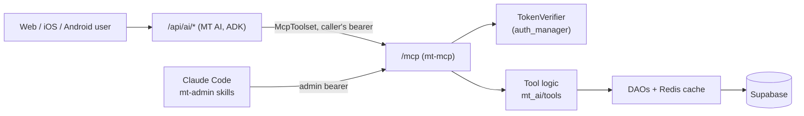

# MT 2.0 — mt-mcp (MT's MCP Server)

> **Audience**: Anyone building MT AI, an mt-admin Claude skill, or an MT tool
> **Prerequisites**: [ai.md](ai.md), [current-state.md](current-state.md)
> **Status**: Decided 2026-10-10 (SB-1301). Built: `/mcp`, auth, tier gate, observability
> (SB-1302); both MT AI tools served over MCP (SB-1303); admin ingest tools, Claude Code connection and the
> `mt-admin` skill (SB-1304). Prod flag: off until enabled in `values-prod.yaml`. Epic: *MT — MCP Server (mt-mcp)*.

mt-mcp is the one typed tool layer for MT, served over the
[Model Context Protocol](https://modelcontextprotocol.io). Every agent that reads or
changes MT data — MT AI, Claude Code admin skills, later anything else — calls the
same tools, under the same authorization, with the same tests.

---

## Why

Before mt-mcp, MT AI's tools were plain Python functions registered directly with the
ADK agent ([ai.md](ai.md#tools)), and admin automation went through the `mt` CLI.
A second agent (Claude Code skills for admin work) would have meant a second copy of
each operation, a third once the CLI is counted. `STAT_FIELDS` already has to be kept
in step between `mt_cli.py` and `GoldenBoot.vue`; that is the failure to avoid.

MCP gives one contract with typed input and output schemas that any MCP client can
call. What it does **not** change: the tool logic stays in ordinary Python with
ordinary unit tests ([ai.md](ai.md), principle 2). mt-mcp is a thin adapter over it.

---

## Where it runs

**Inside the existing backend process**, in the same LKE pod, mounted at `/mcp`
(streamable HTTP), behind `MT_MCP_ENABLED`. This follows MT AI's placement decision
([ai.md](ai.md#where-mt-ai-runs)) for the same reasons: one image, one deploy, direct
DAO calls with the Redis DAO cache, no extra pod on a 4 GB node. Moving it to its own
Deployment of the same image stays a configuration change.

```text
backend/
  mt_mcp/
    server.py       # MCPServer, tools, TierGate middleware, HTTP app
    auth.py         # TokenVerifier over auth_manager; caller → Principal
    scopes.py       # role and client → visible tool tiers (pure)
    observe.py      # ToolCallObserver: per-call metrics + log line
    config.py       # MT_MCP_* settings
  mt_ai/tools/      # MT AI's read tools (logic + Pydantic models)
  mt_tools/         # every other tool's logic: ingest.py (admin, SB-1304); team writes next
```



MT AI reaches mt-mcp over loopback HTTP from the same process. That is one extra local
hop per tool call, accepted in exchange for MT AI and every other client being
authorized by the same code path. Measured locally: a full turn (search over MCP, then
upcoming matches) against the real database took 0.37 s, model excluded.

### Configuration

| Variable | Default | Meaning |
|----------|---------|---------|
| `MT_MCP_ENABLED` | `false` | Mount `/mcp`, and serve every MT AI tool through it. Off = rollback: MT AI registers the same functions in-process |
| `MT_MCP_INTERNAL_URL` | `http://127.0.0.1:8000/mcp/` | How MT AI reaches it (loopback) |
| `MT_MCP_ALLOWED_HOSTS` | `api.missingtable.com` | Host headers accepted besides loopback (DNS-rebinding guard) |

The endpoint is **`/mcp/`** (trailing slash). `/mcp` answers `307` to it.

### Running it locally

```bash
MT_MCP_ENABLED=true ./missing-table.sh dev     # or: MT_MCP_ENABLED=true uv run python app.py
curl -s -o /dev/null -w "%{http_code}\n" -X POST http://127.0.0.1:8000/mcp/ \
  -H 'content-type: application/json' -d '{}'  # 401: a token is required
```

Any MCP client works with a bearer token from `/api/auth/login`; the tests in
`backend/tests/unit/mt_ai/test_mt_mcp_*.py` show the Python client.

### Claude Code (mt-admin skills, SB-1304)

The project `.mcp.json` declares the server; auth comes from the `mt` CLI:

```json
"mt-mcp": {
  "type": "http",
  "url": "${MT_MCP_URL:-http://127.0.0.1:8000/mcp/}",
  "headersHelper": "mt mcp headers"
}
```

`mt mcp headers` prints `{"Authorization": "Bearer …", "X-MT-Client": "claude-code"}`
from the `mt login` session of the targeted environment, refreshing the token when it
is within five minutes of expiry; messages go to stderr, so stdout is only the JSON.
Claude Code runs the helper on each connection and again after a 401/403, then retries
the call once ([Claude Code MCP docs](https://code.claude.com/docs/en/mcp.md)) — so an
expired session heals itself without a restart. The helper only runs after the project's
trust dialog is accepted. Prod: start Claude Code with
`APP_ENV=prod MT_MCP_URL=https://api.missingtable.com/mcp/` after `mt --env prod login`.

The `mt-admin` skill (`.claude/skills/mt-admin/`) drives the admin tools: ingest failure
triage, and closing rows dry-run first, one confirmation each.

### MT AI + mt-mcp with a local Ollama model (SB-1315)

No Gemini key needed: MT AI runs a local model and calls its tools through `/mcp/`.

```bash
cd backend
uv sync --extra local-ai                       # litellm, pinned; never in the prod image
APP_ENV=local ../scripts/db_tools.sh migrate local    # ai_conversations etc., if missing
MT_AI_ENABLED=true MT_AI_MODEL=ollama_chat/gemma4:12b MT_MCP_ENABLED=true \
  uv run python app.py
# Ollama elsewhere (e.g. the mac mini): OLLAMA_API_BASE=http://<host>:11434
```

Then log in and `POST /api/ai/chat` (or use the web app's chat). Each tool call shows up as
an `mt_mcp.tool_call` log line with `client=mt-ai`. Verified 2026-10-10 with `gemma4:12b`:
schedule and team questions answered correctly through both MCP tools; a turn takes tens
of seconds on local hardware, and Gemma's reasoning text can leak into answers to
off-topic questions — a model-profile finding for evals, not an MCP one.

---

## Who it serves

| Role (`user_profiles.role`) | Scope | Notes |
|-----------------------------|-------|-------|
| `admin` | everything, incl. `is_test` content | |
| `club_manager` | every team in `club_id` | `can_manage_team`, `can_edit_match` |
| `team-manager` | one team, `team_id` | same checks |
| `team-player` | themselves; teams via `player_team_history` | **minors** |
| `team-fan`, `club-fan` | a home team / club | read only |
| API account (`is_api_account`) | as its role | the `/api/ai/*` token (SB-1145) |
| `service_account` | — | **refused**: no profile to own provenance or decide visibility |

### Tool tiers

| Tier | Who | Examples |
|------|-----|----------|
| **read** | every role | `search_teams`, `get_upcoming_matches`, `get_standings`, `get_match`, `get_team_stats` (with coverage) |
| **my** | fans, players, managers | `get_my_team` — "when do we play" without naming the team |
| **self** | `team-player` | `get_my_stats`, `get_my_profile` — own records only |
| **team-write** | `team-manager` (own team), `club_manager` (club's teams) | roster add/edit, live scoring |
| **admin** | `admin` | `list_ingest_failures`, `resolve_ingest_failure` (built, SB-1304); team mappings, users, audit next |

---

## Authorization

Three layers, each with one job:

1. **Authentication.** A `TokenVerifier` wraps `auth_manager.verify_token` (Supabase
   session) and `verify_ai_api_token` (API accounts). Anything else — service-account
   tokens, garbage, expired — is a 401. The caller's profile becomes the request
   principal; tools read the viewer from it, **never from arguments**.
2. **Listing (convenience).** `tools/list` returns only the tiers the caller's role and
   client scope allow (`TierGate`, a server middleware; the client is the
   `X-MT-Client` header, which can only narrow). This keeps tool schemas — and so prompts — small. It is **not**
   a security boundary.
3. **Per-call scope check (the boundary).** Every tool re-checks on call. Team-scoped
   tools call `can_manage_team` / `can_edit_match` from `auth.py`; they never
   reimplement them. A refusal is a structured `not_permitted` result.

### Client scope sits on top of role

| Client | Token | Tiers |
|--------|-------|-------|
| MT AI | the end user's | read, my, self — **never** team-write or admin in v1, whatever the role ([ai.md](ai.md#auth)) |
| mt-admin skills (Claude Code) | the admin's | all |

MT AI additionally passes a client-side `tool_filter`, so a server bug cannot widen it.

### Rules for every tool

- **`is_test` visibility** comes from `viewer_sees_test_content(principal)`.
- **Absent is not zero** (root `CLAUDE.md`): missing user data is a successful result
  that says "not tracked", never `0`. Tests per tool cover unclaimed, claimed-empty and
  populated, with the no-user-data team as the default fixture.
- **Players are minors.** No tool returns another player's profile, except a manager
  reading their own roster.
- **Writes record provenance** — user and client — and obey rule 5: a manual entry
  never overwrites a scraped score.
- **Admin writes default to `dry_run=true`.**
- Error messages to clients carry no implementation detail; specifics go to logs.

---

## Typed tools: Pydantic in and out

MCP itself has no models — it is a protocol, and mt-mcp never calls an LLM. What
matters is that every tool is typed, and the SDK builds both schemas from Pydantic:

- **Input**: the tool function's type hints become the published `inputSchema`, and
  arguments are validated before the tool runs.
- **Output**: a tool that returns a Pydantic model (`search_teams` → `ResolveResult`)
  gets a published `outputSchema`, and its result travels as `structuredContent`.
  Tools return the model, never a hand-built dict.
- The models live with the tool logic (`mt_ai/tools/schemas.py`), so the in-process
  tests and the MCP surface share one definition.

MT AI unwraps `structuredContent` back to the plain result before the model sees it
(`unwrap_mcp_result`), so an MCP tool and an in-process tool look identical to the
model and to the `ai_tool_calls` trace — and the model is not shown each result twice.

---

## Observability

HTTP metrics see every call as `POST /mcp/`; mt-mcp adds per-tool signals in
`ToolCallObserver`, the outermost server middleware (so it also sees refused calls):

| Signal | Where | Use |
|--------|-------|-----|
| `mt_mcp_tool_calls_total{tool, client, role, outcome}` | `/metrics` → Grafana | Popular tools, who uses them, outcome mix |
| `mt_mcp_tool_call_seconds{tool, outcome}` | `/metrics` | Latency per tool |
| `mt_mcp.tool_call` event (tool, client, role, outcome, duration, user, arg names, request id) | structlog → Loki | Drill-down |
| `ai_tool_calls` rows, **with arguments** | Supabase (SB-1197) | Replay and evals for MT AI turns |

`outcome` is the tool's own verdict: `resolved` / `ambiguous` / `not_found` for
`search_teams`, `empty` when `get_upcoming_matches` checked and found nothing, an error kind such as `unavailable`, `refused` for a call the tier gate
turned away, `failed` for a protocol error. That makes the learning questions queries:
*which teams do people look for that MT cannot find* (not_found → aliases), *which
searches are ambiguous* (→ better disambiguation), *which tools are popular* (→ what
to build next), *who asks for tools they cannot have* (refused).

In prod the backend runs two uvicorn workers; each keeps its own counters, like the
existing HTTP metrics, so dashboards sum across scrapes (`sum by (...)`, `rate`).

Every label is bounded — unknown tool, client or role names collapse to `other` — and
argument **values** stay out of metrics and logs: tool arguments can name minors. The
dashboard, alerts and the "what MT couldn't answer" report are **SB-1308**.

---

## Verified library facts (2026-10-10)

Read from installed code, not from memory. Re-check when either version moves.

**google-adk 2.10.0** (installed in `backend/`)
- `google.adk.tools.mcp_tool.McpToolset` with `StreamableHTTPConnectionParams`
  (also SSE, stdio).
- `header_provider: Callable[[ReadonlyContext], dict[str, str]]` sets headers per
  request — how MT AI forwards the caller's bearer. ADK caches tool lists per header
  identity.
- `tool_filter` (list or predicate) for the client-side cap.
- Requires the `google-adk[mcp]` extra (`mcp>=1.24,<3`); `mcp` is not installed today.

**mcp (Python SDK) 2.3.0** (latest at time of writing)
- The high-level server is `mcp.server.mcpserver.MCPServer`. The 1.x
  `mcp.server.fastmcp` path is gone — most examples online are 1.x.
- `MCPServer(token_verifier=..., auth=...)`; `TokenVerifier.verify_token(token)` is
  async → wrap the sync `auth_manager` call in `asyncio.to_thread`.
  `get_access_token()` returns the caller inside a tool.
- `streamable_http_app(streamable_http_path="/mcp", stateless_http=..., host=...,
  transport_security=...)` returns a Starlette app to mount; its session manager must
  run inside the FastAPI lifespan (the backend has none yet).
- Role-filtered listing uses the public `middleware=[...]` hook (`ServerMiddleware`:
  `(ctx, call_next)`), not an override of the private `_handle_list_tools`. `mcp` is
  still pinned exactly.
- `host` defaults to `127.0.0.1` with DNS-rebinding protection: allowed hosts must
  include `api.missingtable.com` or ingress traffic is rejected (`421`).

### What slice 1 taught (SB-1302)

- **ADK probes for Google mTLS before every MCP session** — `google.auth.default()`,
  which off-GCP waits on the metadata server: 3–10 s per turn, and the failure is cached
  only per toolset (per turn here). `mt_ai/agent.py` defaults
  `GOOGLE_API_USE_CLIENT_CERTIFICATE=false`; a regression test guards it.
- **mcp 2.x uses `httpx2`**, a separate package from `httpx`. A test client or an
  injected `httpx_client_factory` must build `httpx2.AsyncClient`.
- **The SDK sends `str(exc)` to the client** for an unexpected tool exception
  (prefixed "Error executing tool …"). Tools catch and raise a generic `ToolError`.
- **The caller's identity reaches tools run on worker threads**: `get_access_token()`
  is a contextvar, and anyio copies context into `to_thread`.
- **ADK's MCP tool retries a failed call once** (`retry_on_errors`). Harmless for reads;
  write tools (SB-1305) must be idempotent or carry an idempotency key.
- **Admin writes are dry-run by default and idempotent** (SB-1304): `resolve_ingest_failure`
  returns `would_resolve` until called with `dry_run=false`, and closing a closed row is
  `already_resolved`, never a re-stamp — so ADK's one automatic retry is harmless. The
  closer is the token's user, never an argument. The client (`claude-code`, `mt-ai`) is in
  the `mt_mcp.tool_call` log line next to the user id; the row itself records the user.
- **MT AI's toolset is built per turn** with static headers (the caller's token and
  `X-MT-Client: mt-ai`) and closed after it — simpler than `header_provider`, and one
  local `tools/list` per turn is cheap.

---

## Open questions

| Question | Ticket |
|----------|--------|
| One `team_id`/`club_id` per profile: a parent with kids on two teams, or a fan following several, cannot be represented. Single-team for v1, or a follows/membership table first? | SB-1307 |
| Is a `team-player` account the child, or a parent acting for them? Decides what "self" returns. | SB-1307 |
| Do MT AI users ever get team-write tools? Not before tier-2 evals cover write trajectories ([ai-quality.md](ai-quality.md)). | — |
| Does the `mt` CLI become an MCP client, or keep calling the HTTP API over the same service functions? Either way, one owner per operation. | — |

---

## Slices

| # | Ticket | Outcome |
|---|--------|---------|
| 0 | SB-1301 | This document |
| 1 | SB-1302 | Tracer: `/mcp` mounted, JWT auth, role-filtered listing, `search_teams`; MT AI calls it via `McpToolset` |
| 2 | SB-1303 | All MT AI tools served over MCP; in-process registration removed |
| 3 | SB-1304 | Admin tier (ingest failures) + Claude Code connection + first mt-admin skill |
| 4 | SB-1305 | Team-write tier for team/club managers |
| 5 | SB-1306 | My/self tiers for fans and players (after SB-1307) |
| — | SB-1308 | Observability: dashboard, alerts, "what MT couldn't answer" learning loop |

Each slice updates this document with what it taught, in the same PR.

---

## 📖 Related Documentation

- **[MT 2.0 overview](README.md)**
- **[MT AI](ai.md)** — the agent that is mt-mcp's first client
- **[A2A](a2a.md)** — why external agents are better served by MCP first
- **[AI quality](ai-quality.md)** — tool test tiers
