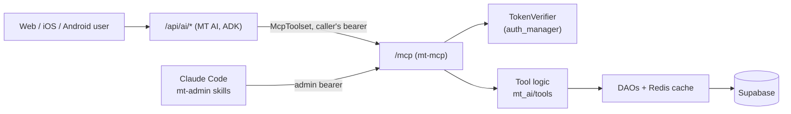

# MT 2.0 — mt-mcp (MT's MCP Server)

> **Audience**: Anyone building MT AI, an mt-admin Claude skill, or an MT tool
> **Prerequisites**: [ai.md](ai.md), [current-state.md](current-state.md)
> **Status**: Decided 2026-10-10 (SB-1301). Epic: *MT — MCP Server (mt-mcp)*. Nothing built yet.

mt-mcp is the one typed tool layer for MT, served over the
[Model Context Protocol](https://modelcontextprotocol.io). Every agent that reads or
changes MT data — MT AI, Claude Code admin skills, later anything else — calls the
same tools, under the same authorization, with the same tests.

---

## Why

Before mt-mcp, MT AI's tools were plain Python functions registered directly with the
ADK agent ([ai.md](ai.md#tools)), and admin automation went through the `mt` CLI.
A second agent (Claude Code skills for admin work) would have meant a second copy of
each operation, a third once the CLI is counted. `STAT_FIELDS` already has to be kept
in step between `mt_cli.py` and `GoldenBoot.vue`; that is the failure to avoid.

MCP gives one contract with typed input and output schemas that any MCP client can
call. What it does **not** change: the tool logic stays in ordinary Python with
ordinary unit tests ([ai.md](ai.md), principle 2). mt-mcp is a thin adapter over it.

---

## Where it runs

**Inside the existing backend process**, in the same LKE pod, mounted at `/mcp`
(streamable HTTP), behind `MT_MCP_ENABLED`. This follows MT AI's placement decision
([ai.md](ai.md#where-mt-ai-runs)) for the same reasons: one image, one deploy, direct
DAO calls with the Redis DAO cache, no extra pod on a 4 GB node. Moving it to its own
Deployment of the same image stays a configuration change.

```text
backend/
  mt_mcp/
    server.py       # MCPServer, tool registration, role-filtered listing
    auth.py         # TokenVerifier over auth_manager; caller → principal
    scopes.py       # role × client scope → visible tool tiers
  mt_ai/tools/      # tool logic (today's home); mt_mcp imports it. Moves to a
                    # neutral package when the first non-AI tool (admin) lands
```



MT AI reaches mt-mcp over loopback HTTP from the same process. That is one extra local
hop per tool call, accepted in exchange for MT AI and every other client being
authorized by the same code path.

---

## Who it serves

| Role (`user_profiles.role`) | Scope | Notes |
|-----------------------------|-------|-------|
| `admin` | everything, incl. `is_test` content | |
| `club_manager` | every team in `club_id` | `can_manage_team`, `can_edit_match` |
| `team-manager` | one team, `team_id` | same checks |
| `team-player` | themselves; teams via `player_team_history` | **minors** |
| `team-fan`, `club-fan` | a home team / club | read only |
| API account (`is_api_account`) | as its role | the `/api/ai/*` token (SB-1145) |
| `service_account` | — | **refused**: no profile to own provenance or decide visibility |

### Tool tiers

| Tier | Who | Examples |
|------|-----|----------|
| **read** | every role | `search_teams`, `get_upcoming_matches`, `get_standings`, `get_match`, `get_team_stats` (with coverage) |
| **my** | fans, players, managers | `get_my_team` — "when do we play" without naming the team |
| **self** | `team-player` | `get_my_stats`, `get_my_profile` — own records only |
| **team-write** | `team-manager` (own team), `club_manager` (club's teams) | roster add/edit, live scoring |
| **admin** | `admin` | ingest failures, team mappings, users, audit |

---

## Authorization

Three layers, each with one job:

1. **Authentication.** A `TokenVerifier` wraps `auth_manager.verify_token` (Supabase
   session) and `verify_ai_api_token` (API accounts). Anything else — service-account
   tokens, garbage, expired — is a 401. The caller's profile becomes the request
   principal; tools read the viewer from it, **never from arguments**.
2. **Listing (convenience).** `tools/list` returns only the tiers the caller's role and
   client scope allow. This keeps tool schemas — and so prompts — small. It is **not**
   a security boundary.
3. **Per-call scope check (the boundary).** Every tool re-checks on call. Team-scoped
   tools call `can_manage_team` / `can_edit_match` from `auth.py`; they never
   reimplement them. A refusal is a structured `not_permitted` result.

### Client scope sits on top of role

| Client | Token | Tiers |
|--------|-------|-------|
| MT AI | the end user's | read, my, self — **never** team-write or admin in v1, whatever the role ([ai.md](ai.md#auth)) |
| mt-admin skills (Claude Code) | the admin's | all |

MT AI additionally passes a client-side `tool_filter`, so a server bug cannot widen it.

### Rules for every tool

- **`is_test` visibility** comes from `viewer_sees_test_content(principal)`.
- **Absent is not zero** (root `CLAUDE.md`): missing user data is a successful result
  that says "not tracked", never `0`. Tests per tool cover unclaimed, claimed-empty and
  populated, with the no-user-data team as the default fixture.
- **Players are minors.** No tool returns another player's profile, except a manager
  reading their own roster.
- **Writes record provenance** — user and client — and obey rule 5: a manual entry
  never overwrites a scraped score.
- **Admin writes default to `dry_run=true`.**
- Error messages to clients carry no implementation detail; specifics go to logs.

---

## Verified library facts (2026-10-10)

Read from installed code, not from memory. Re-check when either version moves.

**google-adk 2.10.0** (installed in `backend/`)
- `google.adk.tools.mcp_tool.McpToolset` with `StreamableHTTPConnectionParams`
  (also SSE, stdio).
- `header_provider: Callable[[ReadonlyContext], dict[str, str]]` sets headers per
  request — how MT AI forwards the caller's bearer. ADK caches tool lists per header
  identity.
- `tool_filter` (list or predicate) for the client-side cap.
- Requires the `google-adk[mcp]` extra (`mcp>=1.24,<3`); `mcp` is not installed today.

**mcp (Python SDK) 2.3.0** (latest at time of writing)
- The high-level server is `mcp.server.mcpserver.MCPServer`. The 1.x
  `mcp.server.fastmcp` path is gone — most examples online are 1.x.
- `MCPServer(token_verifier=..., auth=...)`; `TokenVerifier.verify_token(token)` is
  async → wrap the sync `auth_manager` call in `asyncio.to_thread`.
  `get_access_token()` returns the caller inside a tool.
- `streamable_http_app(streamable_http_path="/mcp", stateless_http=..., host=...,
  transport_security=...)` returns a Starlette app to mount; its session manager must
  run inside the FastAPI lifespan (the backend has none yet).
- `MCPServer.list_tools()` takes no request context, so role-filtered listing
  overrides `_handle_list_tools` (private → pin the `mcp` version).
- `host` defaults to `127.0.0.1` with DNS-rebinding protection: allowed hosts must
  include `api.missingtable.com` or ingress traffic is rejected.

---

## Open questions

| Question | Ticket |
|----------|--------|
| One `team_id`/`club_id` per profile: a parent with kids on two teams, or a fan following several, cannot be represented. Single-team for v1, or a follows/membership table first? | SB-1307 |
| Is a `team-player` account the child, or a parent acting for them? Decides what "self" returns. | SB-1307 |
| Do MT AI users ever get team-write tools? Not before tier-2 evals cover write trajectories ([ai-quality.md](ai-quality.md)). | — |
| Does the `mt` CLI become an MCP client, or keep calling the HTTP API over the same service functions? Either way, one owner per operation. | — |

---

## Slices

| # | Ticket | Outcome |
|---|--------|---------|
| 0 | SB-1301 | This document |
| 1 | SB-1302 | Tracer: `/mcp` mounted, JWT auth, role-filtered listing, `search_teams`; MT AI calls it via `McpToolset` |
| 2 | SB-1303 | All MT AI tools served over MCP; in-process registration removed |
| 3 | SB-1304 | Admin tier (ingest failures) + Claude Code connection + first mt-admin skill |
| 4 | SB-1305 | Team-write tier for team/club managers |
| 5 | SB-1306 | My/self tiers for fans and players (after SB-1307) |

Each slice updates this document with what it taught, in the same PR.

---

## 📖 Related Documentation

- **[MT 2.0 overview](README.md)**
- **[MT AI](ai.md)** — the agent that is mt-mcp's first client
- **[A2A](a2a.md)** — why external agents are better served by MCP first
- **[AI quality](ai-quality.md)** — tool test tiers
