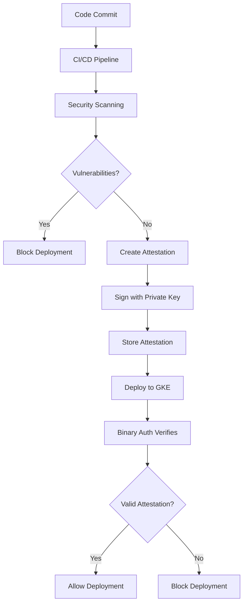

# GCP Infrastructure Security Guide

This document outlines the comprehensive security architecture and procedures for the Missing Table application infrastructure on Google Cloud Platform.

## 🛡️ Security Architecture Overview

### Defense in Depth Strategy

Our security implementation follows a multi-layered approach:

```
┌─────────────────────────────────────────────────────────────┐
│                    🌐 Network Security                      │
│  ┌─────────────────────────────────────────────────────┐   │
│  │              🔐 Identity & Access                   │   │
│  │  ┌─────────────────────────────────────────────┐   │   │
│  │  │            📦 Container Security            │   │   │
│  │  │  ┌─────────────────────────────────────┐   │   │   │
│  │  │  │        🗃️ Data Protection          │   │   │   │
│  │  │  │  ┌─────────────────────────────┐   │   │   │   │
│  │  │  │  │    📊 Monitoring & Audit    │   │   │   │   │
│  │  │  │  └─────────────────────────────┘   │   │   │   │
│  │  │  └─────────────────────────────────────┘   │   │   │
│  │  └─────────────────────────────────────────────┘   │   │
│  └─────────────────────────────────────────────────────┘   │
└─────────────────────────────────────────────────────────────┘
```

## 🔐 Identity and Access Management

### Service Account Architecture

#### Principle of Least Privilege
Each service account has minimal permissions required for its function:

```bash
# Backend Service Account Permissions
missing-table-production-backend@PROJECT.iam.gserviceaccount.com
├── roles/secretmanager.secretAccessor (specific secrets only)
├── roles/logging.logWriter
├── roles/monitoring.metricWriter
└── custom role: limited database access

# Frontend Service Account Permissions  
missing-table-production-frontend@PROJECT.iam.gserviceaccount.com
├── roles/secretmanager.secretAccessor (TLS certificates only)
└── roles/logging.logWriter

# CI/CD Service Account Permissions
missing-table-production-cicd@PROJECT.iam.gserviceaccount.com
├── roles/container.developer
├── roles/secretmanager.secretAccessor
├── roles/binaryauthorization.attestorsVerifier
└── roles/source.writer
```

#### Workload Identity Configuration

Workload Identity eliminates the need for service account keys:

```yaml
# Kubernetes Service Account
apiVersion: v1
kind: ServiceAccount
metadata:
  name: missing-table-backend
  namespace: missing-table
  annotations:
    iam.gke.io/gcp-service-account: missing-table-production-backend@PROJECT.iam.gserviceaccount.com
```

### IAM Best Practices Implementation

#### 1. Regular Access Reviews
```bash
#!/bin/bash
# monthly-iam-review.sh

echo "=== IAM Access Review ==="

# Generate IAM policy report
gcloud projects get-iam-policy PROJECT_ID --format=json > iam-review-$(date +%Y%m).json

# List service account usage
gcloud logging read 'protoPayload.authenticationInfo.principalEmail!=""' \
  --format="value(protoPayload.authenticationInfo.principalEmail)" \
  --since="30d" | sort | uniq -c | sort -nr > service-account-usage.txt

# Check for unused service accounts
gcloud iam service-accounts list --format="value(email)" | while read SA; do
  USAGE=$(gcloud logging read "protoPayload.authenticationInfo.principalEmail=\"$SA\"" --limit=1 --since="90d" --format="value(timestamp)")
  if [ -z "$USAGE" ]; then
    echo "Unused service account: $SA"
  fi
done
```

#### 2. Conditional Access Policies
```hcl
# Conditional IAM binding for sensitive operations
resource "google_project_iam_binding" "conditional_admin" {
  project = var.project_id
  role    = "roles/container.admin"
  members = ["user:admin@company.com"]
  
  condition {
    title       = "Time-based access"
    description = "Admin access only during business hours"
    expression  = "request.time.getHours() >= 9 && request.time.getHours() <= 17"
  }
}
```

## 🌐 Network Security

### VPC Security Architecture

#### Network Segmentation
```
Internet
    │
    ▼
┌───────────────┐
│ Load Balancer │ (Public Subnet: 10.0.1.0/24)
└───────┬───────┘
        │
        ▼
┌───────────────┐
│   GKE Cluster │ (Private Subnet: 10.0.2.0/24)
│               │ ├── Pods: 10.1.0.0/16
│               │ └── Services: 10.2.0.0/16
└───────┬───────┘
        │
        ▼ (Private Google Access)
┌───────────────┐
│ Google APIs   │
│ Secret Mgmt   │
│ Monitoring    │
└───────────────┘
```

#### Firewall Rules (Default Deny)
```bash
# Verify firewall configuration
gcloud compute firewall-rules list --format="table(
  name,
  direction,
  priority,
  sourceRanges.list():label=SRC_RANGES,
  allowed[].map().firewall_rule().list():label=ALLOW,
  targetTags.list():label=TARGET_TAGS
)"

# Expected rules:
# 1. deny-all-ingress (Priority: 65534) - Default deny
# 2. allow-internal (Priority: 1000) - Internal VPC communication
# 3. allow-https (Priority: 1000) - HTTPS traffic to load balancers
# 4. allow-ssh (Priority: 1000) - SSH from authorized networks only
```

#### Private Cluster Configuration
```yaml
# GKE Private Cluster Settings
private_cluster_config:
  enable_private_nodes: true
  enable_private_endpoint: true
  master_ipv4_cidr_block: "172.16.0.0/28"
  
master_authorized_networks:
  - cidr_block: "203.0.113.0/24"
    display_name: "Corporate Network"
  - cidr_block: "198.51.100.0/24"  
    display_name: "VPN Access"
```

### Network Monitoring
```bash
# Enable VPC Flow Logs monitoring
gcloud logging read 'resource.type="gce_subnetwork" AND jsonPayload.connection.protocol!="ICMP"' \
  --format="table(timestamp, jsonPayload.connection.src_ip, jsonPayload.connection.dest_ip, jsonPayload.connection.dest_port)" \
  --limit=50 --since="1h"

# Monitor for suspicious traffic patterns
gcloud logging read 'resource.type="gce_subnetwork" AND jsonPayload.bytes_sent>1000000' \
  --format="table(timestamp, jsonPayload.connection.src_ip, jsonPayload.bytes_sent)" \
  --since="24h"
```

## 📦 Container Security

### Binary Authorization Implementation

#### Attestation Process


#### Security Scanning Integration
```yaml
# .github/workflows/security-scan.yml
- name: Run Trivy vulnerability scanner
  uses: aquasecurity/trivy-action@master
  with:
    image-ref: ${{ env.IMAGE }}
    format: 'sarif'
    output: 'trivy-results.sarif'
    severity: 'CRITICAL,HIGH'
    exit-code: '1'  # Fail build on vulnerabilities

- name: Create Binary Authorization attestation
  if: success()
  run: |
    gcloud beta container binauthz attestations sign-and-create \
      --artifact-url="${{ env.IMAGE }}" \
      --attestor="vulnerability-attestor" \
      --signature-algorithm="rsa-pss-2048-sha256"
```

#### Runtime Security
```bash
# Check for runtime security violations
kubectl get events -A --field-selector reason=FailedMount | grep -i security

# Monitor container breakout attempts  
gcloud logging read 'resource.type="k8s_container" AND jsonPayload.message=~".*privilege.*escalation.*"' --since="24h"

# Check for unauthorized image pulls
gcloud logging read 'resource.type="gke_cluster" AND jsonPayload.decision="DENY"' --since="24h"
```

### Pod Security Standards
```yaml
# Pod Security Policy (where supported)
apiVersion: policy/v1beta1
kind: PodSecurityPolicy
metadata:
  name: missing-table-psp
spec:
  privileged: false
  allowPrivilegeEscalation: false
  requiredDropCapabilities:
    - ALL
  volumes:
    - 'configMap'
    - 'emptyDir'
    - 'projected'
    - 'secret'
    - 'downwardAPI'
    - 'persistentVolumeClaim'
  runAsUser:
    rule: 'MustRunAsNonRoot'
  seLinux:
    rule: 'RunAsAny'
  fsGroup:
    rule: 'RunAsAny'
```

## 🗃️ Data Protection

### Encryption Strategy

#### Encryption at Rest
```bash
# Verify KMS key configuration
gcloud kms keys list --location=global --keyring=missing-table-production-keyring

# Check encryption status
gcloud container clusters describe missing-table-production-cluster \
  --region=us-central1 --format="value(databaseEncryption.state)"

# Verify Secret Manager encryption
gcloud secrets describe missing-table-production-database-url \
  --format="value(replication.userManaged.replicas[0].customerManagedEncryption.kmsKeyName)"
```

#### Encryption in Transit
```yaml
# TLS Configuration for ingress
apiVersion: networking.k8s.io/v1
kind: Ingress
metadata:
  name: missing-table-ingress
  annotations:
    kubernetes.io/ingress.class: "gce"
    kubernetes.io/ingress.global-static-ip-name: "missing-table-ip"
    ingress.gcp.kubernetes.io/ssl-cert: "missing-table-ssl-cert"
    ingress.gcp.kubernetes.io/redirect-to-https: "true"
spec:
  tls:
  - secretName: missing-table-tls
    hosts:
    - missing-table.com
```

### Secret Management

#### Secret Rotation Automation
```python
# Cloud Function for automated secret rotation
import google.cloud.secretmanager as sm
import secrets
import string

def rotate_secret(request):
    """Rotate application secrets automatically"""
    client = sm.SecretManagerServiceClient()
    
    # Generate new secret value
    new_value = ''.join(secrets.choice(string.ascii_letters + string.digits) for _ in range(32))
    
    # Create new version
    parent = f"projects/{PROJECT_ID}/secrets/{SECRET_NAME}"
    response = client.add_secret_version(
        request={
            "parent": parent,
            "payload": {"data": new_value.encode("UTF-8")},
        }
    )
    
    # Trigger application restart
    # kubectl rollout restart deployment/missing-table-backend -n missing-table
    
    return f"Secret rotated: {response.name}"
```

#### Secret Access Monitoring
```bash
# Monitor secret access patterns
gcloud logging read 'protoPayload.serviceName="secretmanager.googleapis.com" AND protoPayload.methodName="google.cloud.secretmanager.v1.SecretManagerService.AccessSecretVersion"' \
  --format="table(timestamp, protoPayload.authenticationInfo.principalEmail, protoPayload.resourceName)" \
  --since="24h"

# Alert on unauthorized access
gcloud alpha monitoring policies create --policy-from-file=unauthorized-secret-access.yaml
```

## 📊 Security Monitoring and Incident Response

### Security Information and Event Management (SIEM)

#### Log Aggregation Strategy
```bash
# Security-relevant log sources
echo "=== Security Log Sources ==="
echo "1. GKE Audit Logs"
echo "2. Secret Manager Access Logs"
echo "3. Binary Authorization Decisions"
echo "4. VPC Flow Logs"
echo "5. IAM Policy Changes"
echo "6. Application Authentication Logs"

# Centralized security log query
gcloud logging read '
  (protoPayload.serviceName="secretmanager.googleapis.com") OR
  (resource.type="gke_cluster" AND jsonPayload.decision="DENY") OR
  (protoPayload.serviceName="iam.googleapis.com" AND protoPayload.methodName=~".*Policy.*") OR
  (resource.type="k8s_container" AND jsonPayload.message=~".*authentication.*failed.*")
' --format="table(timestamp, resource.type, protoPayload.methodName, jsonPayload.message)" --since="24h"
```

#### Security Alerting
```yaml
# Security Alert Policy Configuration
displayName: "Critical Security Alert"
conditions:
  - displayName: "Multiple authentication failures"
    conditionThreshold:
      filter: 'resource.type="k8s_container" AND jsonPayload.message=~".*authentication.*failed.*"'
      comparison: COMPARISON_GREATER_THAN
      thresholdValue: 10
      duration: "300s"
      
  - displayName: "Binary Authorization violations"
    conditionThreshold:
      filter: 'resource.type="gke_cluster" AND jsonPayload.decision="DENY"'
      comparison: COMPARISON_GREATER_THAN
      thresholdValue: 0
      duration: "60s"
```

### Incident Response Procedures

#### Security Incident Classification
| Severity | Description | Examples | Response Time |
|----------|-------------|----------|---------------|
| **Critical** | Active breach or data exposure | Data exfiltration, root access | 15 minutes |
| **High** | Potential security compromise | Multiple auth failures, privilege escalation | 30 minutes |
| **Medium** | Security policy violations | Binary auth denials, unauthorized access attempts | 1 hour |
| **Low** | Security configuration issues | Missing patches, configuration drift | 4 hours |

#### Incident Response Playbook

##### 1. Detection and Analysis
```bash
#!/bin/bash
# security-incident-response.sh

echo "=== Security Incident Response ==="
read -p "Incident ID: " INCIDENT_ID
read -p "Severity (Critical/High/Medium/Low): " SEVERITY

# Immediate containment for Critical/High severity
if [[ "$SEVERITY" == "Critical" || "$SEVERITY" == "High" ]]; then
    echo "Initiating immediate containment..."
    
    # Isolate affected pods
    kubectl label nodes NODE_NAME quarantine=true
    kubectl cordon NODE_NAME
    
    # Revoke suspicious service account access
    gcloud projects remove-iam-policy-binding PROJECT_ID \
      --member="serviceAccount:SUSPICIOUS_SA@PROJECT.iam.gserviceaccount.com" \
      --role="roles/ROLE_NAME"
    
    # Enable enhanced monitoring
    gcloud logging sinks create security-incident-sink \
      bigquery.googleapis.com/projects/PROJECT_ID/datasets/security_incidents \
      --log-filter='severity>=ERROR'
fi

# Evidence collection
mkdir -p /tmp/incident-$INCIDENT_ID
kubectl get all -A -o yaml > /tmp/incident-$INCIDENT_ID/cluster-state.yaml
kubectl get events -A --sort-by=.metadata.creationTimestamp > /tmp/incident-$INCIDENT_ID/events.yaml

# Log collection
gcloud logging read "timestamp>=\"$(date -d '2 hours ago' --iso-8601)\"" \
  --format=json > /tmp/incident-$INCIDENT_ID/logs.json

echo "Evidence collected in /tmp/incident-$INCIDENT_ID/"
```

##### 2. Containment and Eradication
```bash
# Immediate containment actions
echo "=== Containment Actions ==="

# 1. Network isolation
gcloud compute firewall-rules create emergency-deny-all \
  --action=DENY \
  --rules=all \
  --source-ranges=0.0.0.0/0 \
  --target-tags=compromised

# 2. Service account lockdown
gcloud iam service-accounts disable SA_EMAIL

# 3. Secret rotation
gcloud secrets versions destroy VERSION --secret=SECRET_NAME

# 4. Pod termination
kubectl delete pod COMPROMISED_POD -n NAMESPACE --force --grace-period=0
```

##### 3. Recovery and Lessons Learned
```bash
# Recovery verification
echo "=== Recovery Verification ==="

# Verify system integrity
kubectl get pods -A | grep -v Running
gcloud container clusters describe CLUSTER --format="value(status)"

# Security posture verification
gcloud container binauthz policy export
gcloud projects get-iam-policy PROJECT_ID

# Post-incident hardening
# Update security policies based on incident findings
terraform plan -var-file="terraform.tfvars"
terraform apply -var-file="terraform.tfvars"
```

## 🔍 Security Auditing and Compliance

### Compliance Framework Mapping

#### SOC 2 Type II Controls
| Control | Implementation | Verification |
|---------|----------------|--------------|
| **CC6.1** - Logical access controls | IAM, Workload Identity | Monthly access reviews |
| **CC6.2** - Credential management | Secret Manager, rotation | Automated rotation logs |
| **CC6.3** - Network controls | VPC, firewall rules | Network monitoring |
| **CC6.7** - Data transmission | TLS encryption | Certificate monitoring |

#### CIS Google Cloud Platform Benchmark
```bash
# Automated CIS compliance check
#!/bin/bash
# cis-compliance-check.sh

echo "=== CIS GCP Benchmark Compliance Check ==="

# 1.1 Ensure corporate login credentials are used
gcloud organizations get-iam-policy ORG_ID | grep -q "domain:" && echo "✅ 1.1 PASS" || echo "❌ 1.1 FAIL"

# 2.1 Ensure that Cloud Audit Logging is configured properly
gcloud logging sinks list | grep -q "audit" && echo "✅ 2.1 PASS" || echo "❌ 2.1 FAIL"

# 3.1 Ensure default network does not exist
gcloud compute networks list | grep -q "default" && echo "❌ 3.1 FAIL" || echo "✅ 3.1 PASS"

# 3.2 Ensure legacy networks do not exist
gcloud compute networks list --format="value(IPv4Range)" | grep -q "10.240.0.0/16" && echo "❌ 3.2 FAIL" || echo "✅ 3.2 PASS"

# Continue with other checks...
```

### Regular Security Assessments

#### Quarterly Penetration Testing
```bash
# Pre-pentest preparation
echo "=== Penetration Test Preparation ==="

# 1. Document current architecture
terraform graph | dot -Tpng > architecture-diagram.png

# 2. Export security configuration
gcloud container binauthz policy export > binary-auth-policy.yaml
gcloud projects get-iam-policy PROJECT_ID > iam-policy.yaml

# 3. Create test environment snapshot
kubectl get all -A -o yaml > cluster-config-baseline.yaml

# 4. Enable detailed logging for test period
gcloud logging sinks create pentest-logs \
  bigquery.googleapis.com/projects/PROJECT_ID/datasets/pentest_logs \
  --log-filter='severity>=INFO'
```

#### Vulnerability Management
```bash
# Weekly vulnerability assessment
#!/bin/bash
# vulnerability-scan.sh

echo "=== Vulnerability Assessment ==="

# 1. Container image scanning
docker run --rm -v /var/run/docker.sock:/var/run/docker.sock \
  aquasec/trivy image --format json --output trivy-report.json \
  gcr.io/PROJECT/missing-table-backend:latest

# 2. Infrastructure scanning
terraform plan -out=tfplan
tfsec tfplan --format json --out tfsec-report.json

# 3. Kubernetes configuration scanning
kube-score score gcp/k8s/production/*.yaml > kubescore-report.txt

# 4. Network scanning (internal only)
nmap -sS -O internal-load-balancer-ip > nmap-report.txt

echo "Vulnerability reports generated"
```

## 🚨 Security Best Practices

### Development Security

#### Secure Development Lifecycle
1. **Design Phase**: Threat modeling and security requirements
2. **Development Phase**: Secure coding practices and SAST
3. **Testing Phase**: DAST and penetration testing
4. **Deployment Phase**: Security scanning and attestation
5. **Operations Phase**: Monitoring and incident response

#### Security Training Requirements
- **All Developers**: Secure coding practices (quarterly)
- **DevOps Team**: Infrastructure security (bi-annually)
- **Security Team**: Advanced threat detection (annually)

### Operational Security

#### Security Hygiene Checklist
```bash
# Daily security tasks
- [ ] Review security alerts and logs
- [ ] Verify Binary Authorization compliance
- [ ] Check for failed authentication attempts
- [ ] Monitor resource access patterns

# Weekly security tasks  
- [ ] Review and approve pending access requests
- [ ] Update security patches and policies
- [ ] Rotate short-term credentials
- [ ] Validate backup integrity

# Monthly security tasks
- [ ] Conduct access reviews
- [ ] Update security documentation
- [ ] Review and test incident response procedures
- [ ] Analyze security metrics and trends
```

## 📞 Security Contacts

### Security Team
- **Primary Security Contact**: security@company.com
- **Security Incident Hotline**: +1-555-SECURITY
- **CISO**: ciso@company.com

### External Partners
- **Security Vendor**: vendor-security@partner.com
- **Penetration Testing**: pentest@security-firm.com
- **Compliance Auditor**: audit@compliance-firm.com

### Emergency Escalation
1. **Immediate Response**: Security Team Lead
2. **30-minute escalation**: CISO
3. **1-hour escalation**: CTO
4. **Executive escalation**: CEO

---

**Remember**: Security is everyone's responsibility. Stay vigilant, follow procedures, and report suspicious activities immediately.